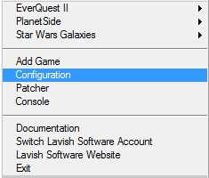
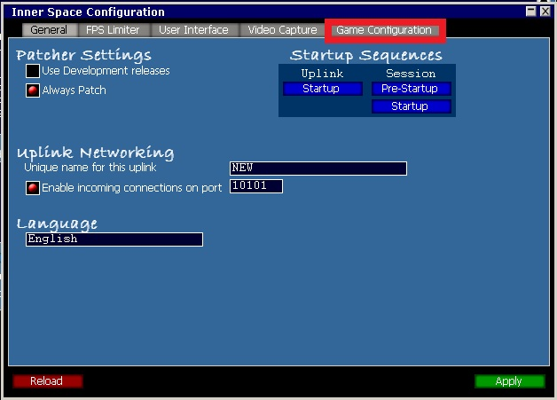
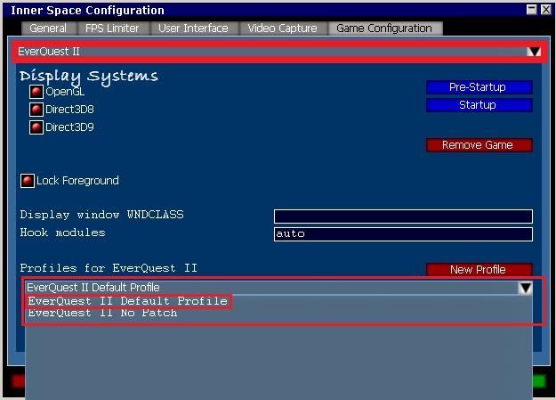
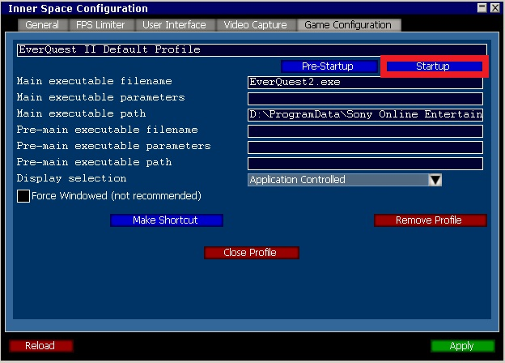
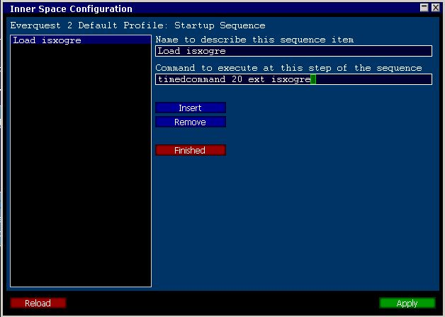

# Auto-Loading ISXOgre

By default, you need to manually type `ext ISXOgre` in the InnerSpace console each time you launch EQ2. You can configure InnerSpace to load ISXOgre automatically so this happens every time you start a session.

> **:bulb: Already Auto-Loading ISXEQ2?**
>
> If you already have ISXEQ2 set to auto-load, you can simply change it to ISXOgre. When ISXOgre loads, it automatically loads ISXEQ2 for you.

---

## Step-by-Step Setup

### Step 1: Open InnerSpace Configuration

Right-click the InnerSpace icon in your system tray and select **Configuration**.



### Step 2: Select Your Game

In the InnerSpace Configuration window, go to the **Game Configuration** tab and select **Everquest II** from the first dropdown.



### Step 3: Select Your Profile

Select your EQ2 launch profile from the second dropdown.



### Step 4: Open Startup Settings

Click the **Startup** button.



### Step 5: Add the Auto-Load Command

1. Click **Insert** to create a new startup entry
2. Name the entry (for example, `Load Ogre`)
3. Enter this command:

```
timedcommand 20 ext isxogre
```



### Step 6: Save and Close

Click **Apply**, then **Finished**, then **Close Profile**.

The next time you launch EQ2 through InnerSpace, ISXOgre will load automatically.

---

## Desktop Shortcut

> **:bulb: Quick Launch**
>
> After selecting your profile, use the **Make Shortcut** button to create a desktop shortcut. This lets you launch EQ2 with ISXOgre directly from your desktop without navigating through the InnerSpace menus each time.

<!-- Source: wiki.ogregaming.com/eq2/index.php/Help:AutoLoadingISXOgre -->
