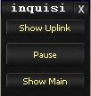
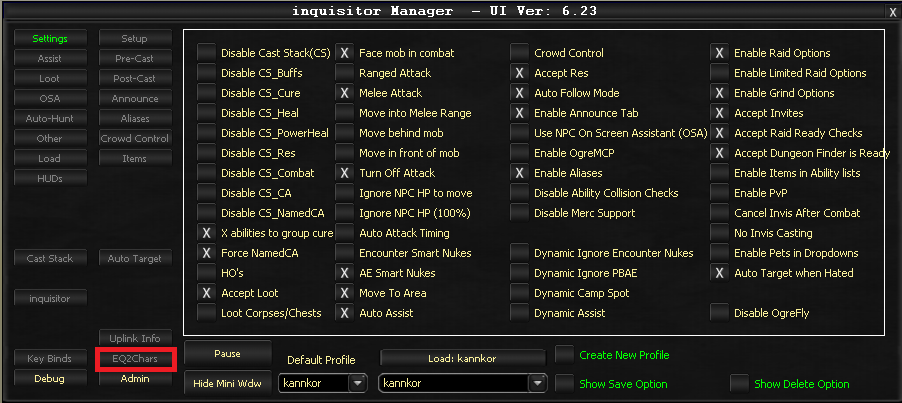

# First Run Guide

You have OgreBot installed and your abilities exported. This guide covers what to expect on your first session and the essential settings to get you started.

---

## What Happens When OgreBot Loads

When you type `ogre` in the InnerSpace console, OgreBot:

1. Loads your profile (or a sample profile if this is your first time)
2. Reads your exported ability data
3. Opens a small **mini window** with three buttons

| Button | What It Does |
|--------|-------------|
| **Show Main** | Opens the full OgreBot configuration UI |
| **Pause** | Pauses all bot activity |
| **Show Uplink** | Opens the Uplink communication window |

Click **Show Main** to open the primary interface.

---

## The Main UI at a Glance

The OgreBot main window is organized into tabs along the top. Each tab controls a different aspect of the bot. Here are the most important ones to know first:

| Tab | Purpose |
|-----|---------|
| **Settings** | Master enable/disable switches for major features (buffs, combat, healing, etc.) |
| **Setup** | Thresholds and percentages (when to attack, heal percentages, follow distance) |
| **Cast Stack** | Your ability priority list -- the order OgreBot casts spells |
| **Assist** | Who the bot assists (targets) in combat |
| **Aliases** | Name references for group members (e.g., `*Tank`, `*Healer`) |

---

## Essential First Settings

### 1. Check the Settings Tab

The Settings tab has master checkboxes that enable or disable major features. Make sure the basics are turned on:

- **Buffs** -- Maintain your buffs automatically
- **Combat Arts / Spells** -- Cast offensive abilities
- **Cures** -- Automatically cure detrimental effects
- **Resurrect** -- Revive dead group members

> **:bulb: Start Simple**
>
> On your first run, leave most settings at their defaults. The sample profile has reasonable starting values for your class.

### 2. Set Your Assist Target

On the **Assist** tab, configure who OgreBot should target in combat. Common options:

- **@Tank** -- Assist whoever the tank is targeting (most common for DPS)
- **A specific character name** -- Always assist that player

### 3. Review Your Cast Stack

The **Cast Stack** tab shows the priority order for your abilities. Every class comes with a sample loadout. You do not need to change this immediately, but as you learn the system you will want to customize it for your playstyle.

### 4. Set Up Aliases

If you are boxing multiple characters, set up aliases on the **Aliases** tab so you can reference group members easily. See the [Aliases Guide](../ogrebot/aliases.md) for details.

---

## Tips for Your First Session

> **:memo: Let It Run**
>
> OgreBot works best when you let it handle combat automatically. Resist the urge to manually cast abilities -- the bot is likely faster and more efficient than manual play.

> **:bulb: Use Pause**
>
> The **Pause** button on the mini window is your friend. If you need to stop the bot temporarily (to talk to an NPC, manage inventory, etc.), pause it rather than closing it.

> **:warning: Re-Export After Changes**
>
> If you train new abilities, change AA specs, or a game update adds new spells, remember to run `ogre export` again so OgreBot knows about your new abilities.

---

## Where to Go From Here

Now that you have the basics down, explore these topics:

- **[Profiles](../ogrebot/profiles.md)** -- Save and share your configuration across characters
- **[Aliases](../ogrebot/aliases.md)** -- Reference group members without hardcoding names
- **[Instance Controller](../ogrebot/instance-controller.md)** -- Automate boss fight mechanics
- **[OgreCraft](../tools/ogrecraft.md)** -- Automate crafting
- **[FAQ](faq.md)** -- Troubleshooting common issues

<!-- Source: Skeleton page - content based on OgreBot general knowledge -->
