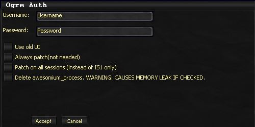
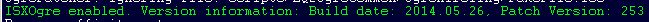
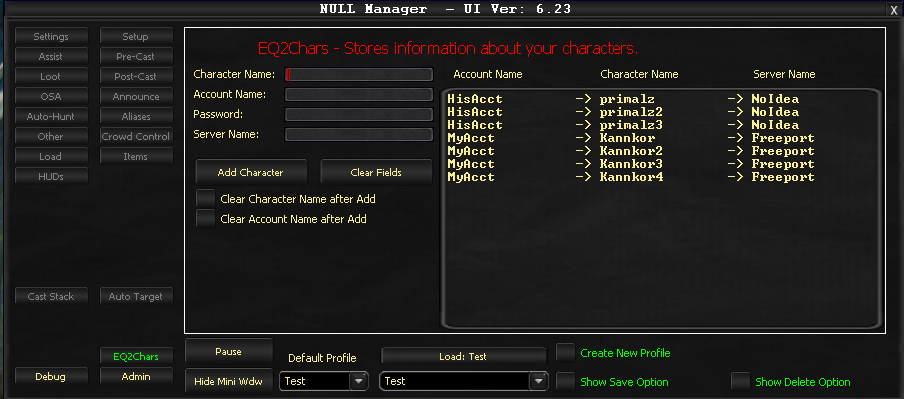

# Installation Guide

This guide walks you through installing and running OgreBot for the first time, from downloading the files to seeing the bot in action.

---

## Prerequisites

Before you begin, make sure you have:

- [x] An active **InnerSpace** subscription (installed and working)
- [x] An active **ISXEQ2** subscription (installed and working)
- [x] An active **ISXOgre** subscription ([see Pricing](../about/pricing.md))

> **:warning: Required Order**
>
> InnerSpace and ISXEQ2 must be installed and working **before** you install ISXOgre. If you do not have these yet, set them up first.

---

## Step 1: Download ISXOgre

Open the InnerSpace console and paste this command to download the ISXOgre extension:

```
httpget -file "${LavishScript.HomeDirectory}/x64/Extensions/ISXDK35/ISXOgre.dll" https://cluster1.ogregaming.com/eq2/download_isxogre.php
```

> **:bulb: Alternative: Manual Download**
>
> You can also download manually from [https://cluster1.ogregaming.com/eq2/download_isxogre.php](https://cluster1.ogregaming.com/eq2/download_isxogre.php) and save the file into your InnerSpace extensions folder:
> `<InnerSpace Directory>/x64/Extensions/ISXDK35/`
> The file **must** be named exactly `ISXOgre.dll`.

> **:memo: 64-bit Required**
>
> InnerSpace must be running as a 64-bit application, which is the default setting. If you changed this, switch it back.

---

## Step 2: Load ISXOgre

1. Launch EQ2 through InnerSpace
2. Once in-game, open the InnerSpace console by pressing the **tilde key** (`~`)
3. Type `ext ISXOgre` and press Enter

<!-- TODO: Add screenshot of console with ext ISXOgre command -->

> **:bulb: Auto-Loading**
>
> You can configure ISXOgre to load automatically every time you launch EQ2 so you do not need to type the command each session. See the [Auto-Loading ISXOgre](auto-loading.md) guide for setup instructions.

---

## Step 3: Authenticate

When ISXOgre loads for the first time, an authentication window appears:

1. Enter your **username** and **password** (these were sent to you via email when you subscribed)
2. Credentials are **case-sensitive** -- copy and paste them to avoid typos
3. Leave the checkboxes unchecked for now
4. Click **OK**



> **:warning: Case-Sensitive Credentials**
>
> Your username and password must be entered exactly as provided. If you are having trouble, copy and paste them directly from the email.

---

## Step 4: Initial Download

After successful authentication, ISXOgre downloads all required files. This includes over 200 files and may take several minutes depending on your connection.

When the download completes, you will see a green confirmation message in the console indicating that ISXOgre is ready.



---

## Step 5: Run OgreBot

1. Open the InnerSpace console (`~`)
2. Type `ogre` and press Enter
3. A window will briefly appear and then disappear -- this is normal

<!-- TODO: Add screenshot of console with ogre command -->

---

## Step 6: Export Your Abilities

Before OgreBot can manage your character, it needs to learn your abilities through an export:

1. Open the console (`~`)
2. Type `ogre export` and press Enter
3. The export scans every ability your character has and saves that information

> **:warning: During Export**
>
> **Do not zone, camp, or recast abilities** while the export is running. It takes approximately 5 minutes to complete.

> **:memo: Per-Character**
>
> The export must be done once per character. You should also re-export whenever you gain new abilities, change AA specs, or after a game update adds new spell lines.

---

## Step 7: Open the OgreBot UI

After the export completes:

1. Close the console if it is open
2. Look for a small floating window with three buttons: **Show Uplink**, **Pause**, and **Show Main**
3. Click **Show Main** to open the primary OgreBot interface


---

## Step 8: Set Up EQ2Chars

The EQ2Chars tab configures your character list. This serves three purposes:

1. **Login convenience** -- allows logging in without manually entering credentials
2. **Auto-login** -- enables automatic character login (an advanced feature you can set up later)
3. **Bot authorization** -- creates a trusted list of characters that OgreBot will automatically interact with (accept group invites, trades, etc.)

> **:bulb: Highly Recommended**
>
> While technically optional, filling out the EQ2Chars tab is strongly recommended. OgreBot will only automatically accept group invites and perform other trusted actions for characters on this list.

To access it, click the **EQ2Chars** button in the bottom-left area of the OgreBot main window.



---

## Step 9: Reload and Go

Once the export is complete and EQ2Chars is configured:

1. Open the console (`~`)
2. Type `ogre` and press Enter to reload OgreBot with your exported data
3. You are now ready to use OgreBot

---

## Next Steps

You now have OgreBot installed and running. Here is where to go from here:

- **[First Run Guide](first-run.md)** -- Learn the basics of the OgreBot UI and essential settings
- **[FAQ](faq.md)** -- Common questions and troubleshooting
- **[Profiles](../ogrebot/profiles.md)** -- Understanding how to save and share your configuration
- **[Aliases](../ogrebot/aliases.md)** -- Set up group member references

> **:bulb: Sample Profiles**
>
> Every class comes with a sample profile that gives you a working starting point. You can start playing immediately and fine-tune settings as you learn the system.

<!-- Source: wiki.ogregaming.com/eq2/index.php/NewUserWalkthrough:Page01-05 - This page may need updating -->
