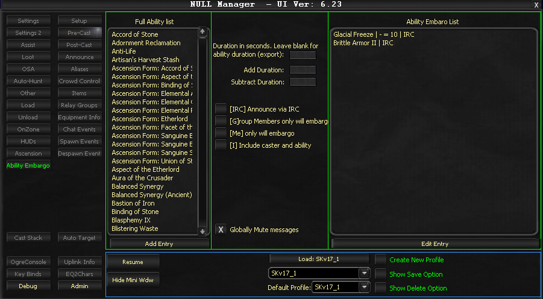

# Ability Embargo

The Ability Embargo tab allows you to control abilities so they can be delayed for yourself or rotated within a raid. For instance, abilities like Glacial Freeze can be prevented from simultaneous casting across the group by setting embargo durations that prevent recasting within specified timeframes.

> **:exclamation: Important**
>
> Ability Embargo must be enabled in the Settings tab for these functions to operate.

## Frame 1: Full Ability List

Displays all available abilities that can have embargo settings applied.

## Frame 2: Settings and Controls

### Duration in seconds

Specifies how long before an ability can be recast by another group or raid member.

### Add Duration / Subtract Duration

Increases or decreases the embargo duration by a specified number of seconds.

### Checkboxes

| Checkbox | Abbreviation | Description |
|----------|-------------|-------------|
| **Announce via IRC** | [IRC] | Broadcasts embargo activity to IRC channels |
| **Group Members only will embargo** | [G] | Restricts embargo listening to local group members only |
| **Only will embargo** | [Me] | Applies embargo only to the current character |
| **Include caster and ability** | [I] | Outputs ability and caster names instead of ID numbers |
| **Globally Mute messages** | -- | Silences console messages while preserving IRC notifications |

## Frame 3: Ability Embargo List

Shows all currently active embargoes and their remaining durations.

<!-- Source: wiki.ogregaming.com - This page may need updating -->
