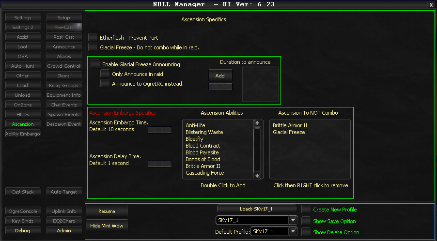

# Ascension

The Ascension tab manages various Ascension ability settings including ability restrictions, combo management, and notification options.

## Ability Options

### Etherflash

Primarily restricts the teleportation ability. Note that some instances of Etherflash cannot be prevented.

### Glacial Freeze

Prevents ability combos while participating in raid activities.

### Enable Glacial Freeze Announcing

Primarily for raid scenarios. With higher-tier raid enemies, maintaining Glacial Freeze becomes critical, making fade notifications valuable. This checkbox activates that feature.

Sub-options:

- **Only Announce in raid** - Suppresses notifications outside raid groups
- **Announce to OgreIRC instead** - Directs notifications to OgreIRC rather than the console
- **Add/text entry** - Permits custom duration thresholds
- **Duration to announce listbox** - Specifies when notifications trigger (for example: "Glacial Freeze: training dummy -> 44s")

## Ascension Embargo

> **:exclamation: Important**
>
> Ascension Embargo must be enabled in the Settings tab for these functions to operate.

### Configuration Options

| Setting | Description | Default |
|---------|-------------|---------|
| **Ascension Embargo Time** | Interval between starting ability casts | 10 seconds |
| **Ascension Delay Time** | Interval between detecting combos and executing them | 1 second |
| **Ascension Abilities** | Master listing of all available ascension abilities | -- |
| **Ascension To NOT Combo** | Excludes specified abilities from automatic combos | -- |

<!-- Source: wiki.ogregaming.com - This page may need updating -->
