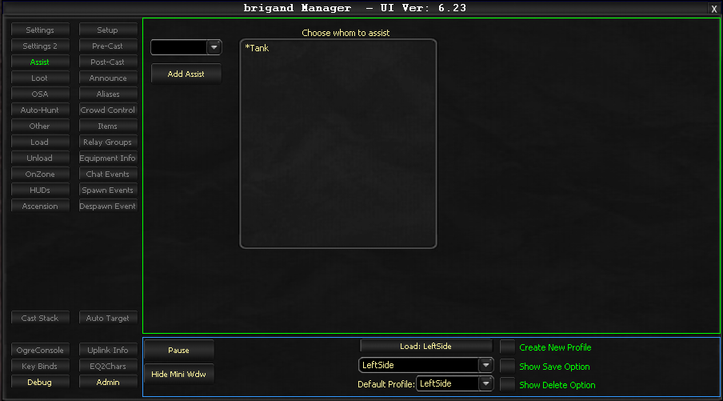

# Assist

The Assist tab manages which character your bot will assist during combat.

## Configuration

### Enable/Disable

The Assist functionality is controlled by the **Auto Assist** checkbox on the Settings tab.

### Assist Target Dropdown

The dropdown menu selects your primary assist target. If the selected person becomes unavailable as an assist target (for example, they are no longer in your raid or group), the system automatically moves to the next person on the list.

## Usage Notes

For real-time assist target changes during gameplay, use **OgreMCP's Assist option** rather than modifying settings through this tab directly. OgreMCP provides a faster and more convenient way to switch assist targets on the fly.

<!-- Source: wiki.ogregaming.com - This page may need updating -->
