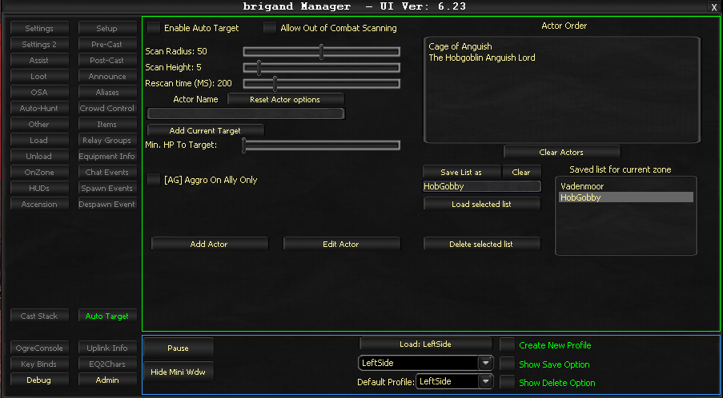

# Auto Target

Auto Target provides an automated way to target mobs in a certain order or to target mobs that spawn as part of an encounter.

!!! important
    Auto Target will supersede any auto assist settings when enabled.

## Core Settings

- **Enable Auto Target** - Toggles the feature on or off
- **Scan Radius** - Determines how far the bot searches for targets
- **Rescan Time** - Interval between target searches (in milliseconds)

## Actor Management

- **Actor Name** - Any attackable NPC name
- **Reset Actor options** - Restores default settings for the selected actor
- **Add Current Target** - Adds your current in-game target to the list
- **Min. HP To Target** - Health percentage threshold before targeting this actor
- **Actor Order** - Prioritization sequence (targets are processed top to bottom)
- **Clear Actors** - Empties the entire targeting list

## List Operations

- **Save List as** - Saves the current actor list with a custom name
- **Clear** - Empties the text box
- **Load selected list** - Loads a previously saved configuration
- **Delete selected list** - Removes a saved configuration
- **Add Actor** - Inserts a new actor from the text box
- **Edit Actor** - Modifies the selected actor's properties

## Key Notes

- Configurations are saved by zone and automatically refreshed upon zoning
- AutoAssist is disabled when Auto Target is enabled
- Supports health-based targeting thresholds

!!! note
    This is considered an advanced option and is offered as-is.

<!-- Source: wiki.ogregaming.com - This page may need updating -->
