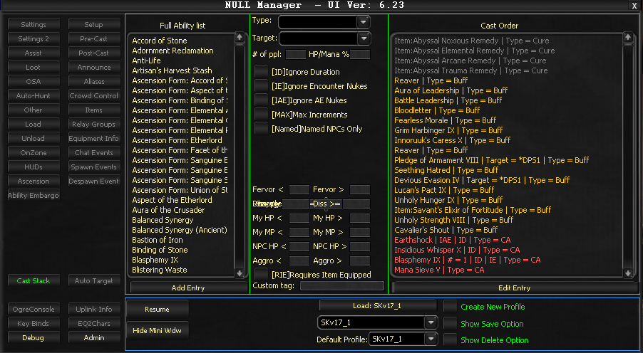

# Cast Stack

The Cast Stack tab replaces the previous CA (Casting) system. Abilities execute in top-down order as they become available.

## Core Functionality

### Adding Abilities

Select an ability from the left list, choose its type, configure options, then click **Add Entry**. Abilities can be reordered by dragging them in the list.

### Ability Types

| Type | Description |
|------|-------------|
| **CA** | Combat Art - no target specification needed |
| **NamedCA** | Named Combat Art - only used against named NPCs |
| **NonNamedCA** | Non-Named Combat Art - only used against non-named mobs |
| **Combat** | Combat ability - target selection required |
| **Debuff** | Debuff ability - toggle debuffing on/off |
| **NamedDebuff** | Named Debuff - only used against named NPCs |
| **Heal** | Heal ability - target and HP percentage threshold required |
| **PowerHeal** | Power Heal ability - target and power percentage threshold required |
| **Buff** | Buff ability - target selection may be required |
| **NonCombatBuff** | Non-Combat Buff - target selection may be required |
| **Cure** | Cure ability - target selection may be required |

## Checkboxes

| Checkbox | Abbreviation | Function |
|----------|-------------|----------|
| **Ignore Duration** | [ID] | Uses abilities as soon as available, potentially overwriting existing instances |
| **Ignore Encounter Nukes** | [IE] | Casts green AE abilities against single mobs |
| **Ignore AE Nukes** | [IAE] | Casts blue AE abilities against single mobs |
| **Max Increments** | [MAX] | Uses ability only when at maximum increments |
| **Named NPCs Only** | [Named] | Restricts casting to Named NPC targets only |
| **Requires Item Equipped** | [RIE] | Item must be equipped/worn to activate the ability |

## Textbox Settings

### Numeric Thresholds

| Setting | Description |
|---------|-------------|
| **Fervor (</>)** | Conditional ability firing based on fervor value |
| **Dissonance (<=>=)** | Channeler-specific resource management |
| **Savagery Required** | Beastlord-specific savagery slider threshold |
| **My HP (</>)** | Personal health percentage thresholds |
| **My MP (</>)** | Personal mana/power percentage thresholds |
| **NPC HP (</>)** | Target NPC health percentage thresholds |
| **Aggro (</>)** | Threat level conditions |
| **Custom Tag** | Enable/disable ability groups via MCP button |

### Group Mechanics

Heal and Rez abilities use the entered number for targeting decisions (e.g., which group member to heal based on health thresholds).

<!-- Source: wiki.ogregaming.com - This page may need updating -->
