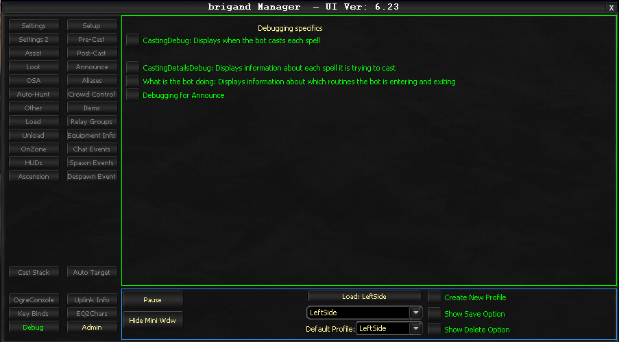

# Debug

The Debug tab outputs debug information to the InnerSpace console. It provides four configurable debug options, each controlled by a checkbox.

## Debug Options

| Option | Description |
|--------|-------------|
| **Casting Debug** | Displays debug info when the bot casts each spell |
| **Casting Details Debug** | Displays debug info about each spell the bot is trying to cast |
| **What is the Bot Doing** | Displays debug info about the routines the bot is entering and exiting |
| **Debugging for Announce** | Displays debug info about any announces |

Each option can be independently enabled or disabled to control which debugging information is output to the InnerSpace console during bot operation.

<!-- Source: wiki.ogregaming.com - This page may need updating -->
