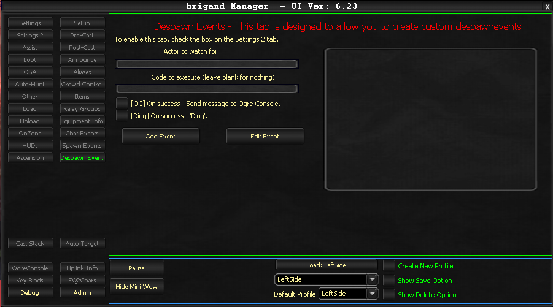

# Despawn Events

The Despawn Events tab enables monitoring for when certain NPCs despawn and then executes a single line of code when the trigger occurs. This tab must be enabled via the **Enable Despawn Events** checkbox on the Settings 2 tab.

## Settings

### Actor to watch for

Specify the NPC name that triggers the bot's monitoring function when it despawns.

### Code to execute

A single line of code to run when the monitored NPC despawns. This accepts commands from the OgreBotAPI.

### [OC] On success - Send message to Ogre Console

When enabled, the bot notifies you via the Ogre Console when the watched NPC despawns.

### [Ding] On success

When enabled, the bot plays an audible sound alert upon detecting the NPC despawning.

## Example

| Field | Value |
|-------|-------|
| **Actor to watch for** | `an iksar child` |
| **Code to execute** | `OgreBotAPI:Jump[all]` |
| **[OC] On success** | Checked |
| **[Ding] On success** | Checked |

**Result:** The bot monitors for "an iksar child" to despawn. Upon detection, it executes `OgreBotAPI:Jump[all]`, causing the entire group to jump. You also receive a console message and audible notification.

<!-- Source: wiki.ogregaming.com - This page may need updating -->
