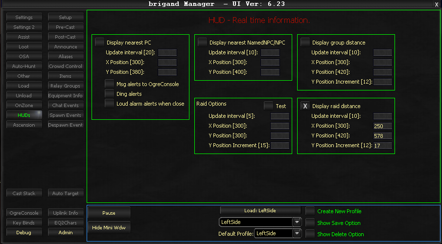
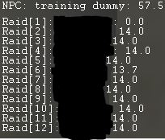

# HUDs

The HUDs tab provides real-time information displayed on-screen. It replaces the older "Mob/Priest Info" option and allows customization of displayed information, screen position, and update frequency.

!!! note
    Raid/Grind Options currently remain at fixed positions (300,300 to 300,400) and are not yet integrated into this system.

## Configuration Options

### Update Interval

Measured in frames, this controls the refresh frequency. Higher values improve performance by reducing CPU usage. It is recommended not to go below 5, with 10 being a practical minimum for most users.

### X Position

The horizontal coordinate determining where the HUD displays on screen.

### Y Position

The vertical coordinate for HUD placement. For multi-item displays (group/raid), this marks where the first entry appears.

### Y Position Increment

Applies only to multiple-item displays. Each subsequent entry adds this value to the Y Position, creating vertical spacing between entries.

## Available HUD Displays

### Display nearest NamedNPC/NPC

Shows the closest named NPC, or a standard NPC if no named NPC exists nearby.

### Display nearest PC

Identifies the nearest player character outside your group or raid. This option uses significant processing power.

### Display Group Distance

Lists group members with distance metrics. Color coding indicates proximity:

| Color | Distance |
|-------|----------|
| White | Less than 30 meters |
| Yellow | 30-75 meters |
| Red | Greater than 75 meters |

### Display Raid Distance

Shows raid members with distance information. Automatically disables group display when active. Includes spacers every 6 players.

| Color | Distance |
|-------|----------|
| White | Less than 20 meters |
| Yellow | 20-30 meters |
| Orange | 30-75 meters |
| Red | Greater than 75 meters |

### Raid HUD Example

Here is an example of the Raid Distance HUD in action during a raid:

<!-- Source: wiki.ogregaming.com - This page may need updating -->
