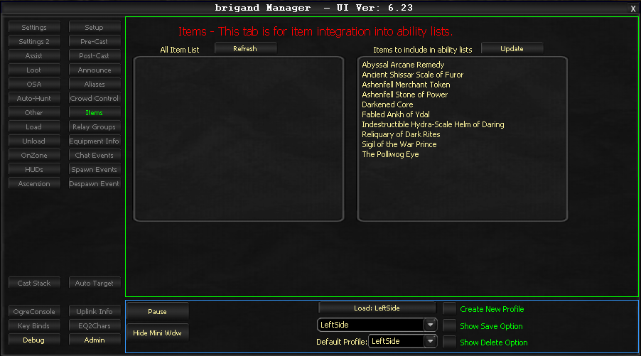

# Items

The Items tab enables you to add clickable items from your inventory to OgreBot's ability rotation system.

## Refresh Function

The **Refresh** button loads activatable items from your inventory. This process takes 20-30 seconds because it requires server calls to determine item properties (such as whether they are clickable items).

> **:warning: Warning**
>
> **DO NOT MODIFY YOUR INVENTORY WHILE THE REFRESH IS RUNNING.** Changing your inventory during a refresh can cause array errors that disrupt the scanning operation.

## Item Management

- Items added to the right side are saved with your profiles
- All items use the prefix format `Item:` (for example: `Item:Manastone`)
- To remove an item, either delete it from the right side or disable it via double-click
- Changes take effect only after reloading profiles or restarting the bot

## Technical Limitations

- No range data exists for items; the default range is set to 30 based on testing
- No way to verify if items work on group members versus raid members
- Pet targeting is not supported; items work only on player characters
- Items cannot be queued like abilities; recovery time detection is unavailable
- Defensive items forcefully change targets during use

## Supported Cast Stack Types

Items work with the following cast stack types:

- Priority-Combat
- Power Heals
- CAs
- NamedCAs
- Non-combat buffs (defensive items)
- CA (offensive items)

<!-- Source: wiki.ogregaming.com - This page may need updating -->
