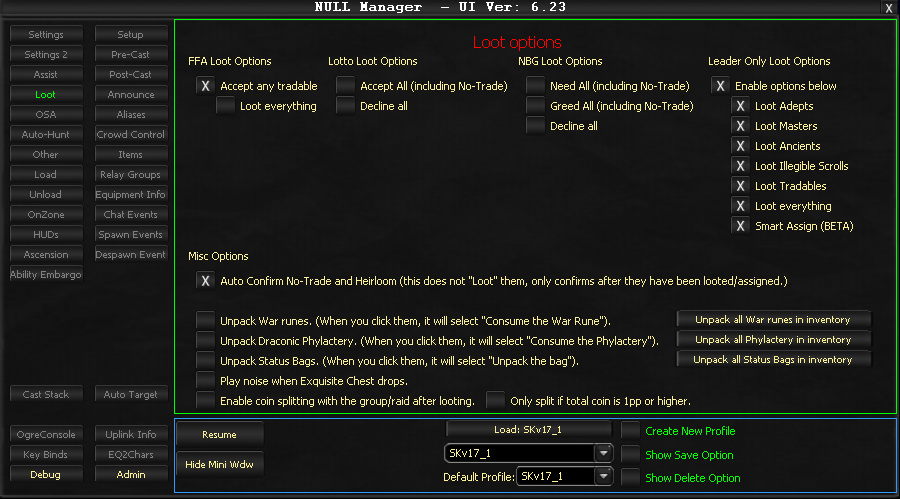

# Loot

The Loot tab controls automated responses when loot windows appear in-game.

!!! note
    Leader Only functionality is not available in ISXEQ2. The bot can only read the most recent loot window when multiple appear simultaneously.

## FFA Loot Options

- **Accept any tradable** - Automatically accepts tradable items from Free-for-All loot windows
    - **Loot everything** - Accepts all items including no-trade and heirloom items (requires "Accept any tradable" to be enabled)

## Lotto Loot Options

- **Accept All (including non-tradables)** - Automatically clicks the "All" button on lotto loot windows
- **Decline All** - Automatically clicks the "Decline" button on lotto loot windows

## NBG (Need Before Greed) Loot Options

- **Need All (including non-tradables)** - Automatically selects "Need" on all items
- **Greed All (including non-tradables)** - Automatically selects "Greed" on all items
- **Decline All (including non-tradables)** - Automatically declines all items

## Leader Only Loot Options

!!! warning
    Leader Only loot is not available in the current ISXEQ2 implementation.

## Miscellaneous Options

- **Auto Confirm No-Trade and Heirloom** - Automatically confirms receipt of no-trade and heirloom restricted items
- **War Rune unpacking** - Provides individual and bulk unpack options for War Runes
- **Draconic Phylactery unpacking** - Provides individual and bulk unpack options for Draconic Phylacteries
- **Status Bag unpacking** - Provides unpack options for status bags
- **Exquisite Chest notification** - Plays an audio alert when exquisite chests drop
- **Coin splitting** - Distributes currency to group/raid members with a configurable platinum threshold option

## Usage Notes

The Loot tab pairs well with Auto Hunt features. For unattended farming scenarios, it is recommended to set in-game loot to Round-Robin and enable the auto-confirm options.

<!-- Source: wiki.ogregaming.com - This page may need updating -->
