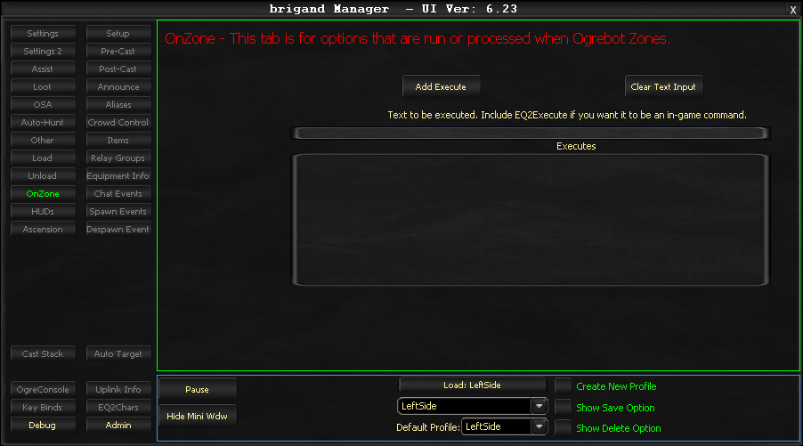

# On Zone

The On Zone tab manages automated actions triggered during zone transitions. It allows you to configure scripts and commands that will automatically run after the player completes a zone change.

## Executes

The primary feature allows you to configure scripts and commands that will automatically run after completing a zone change. This enables streamlined automation workflows by executing predefined actions upon entering new zones.

Use this to set up actions that should happen every time you zone, such as rebuffing, repositioning, or running initialization scripts.

<!-- Source: wiki.ogregaming.com - This page may need updating -->
