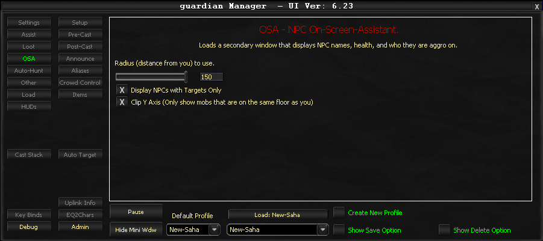

# OSA (On Screen Assistant)

The OSA (On Screen Assistant) tab configures the NPC On Screen Assistant feature. This feature must be enabled via the **Use NPC On Screen Assistant (OSA)** checkbox on the Settings tab.

The OSA provides on-screen tracking and information about NPCs during gameplay.

Documentation coming soon.

<!-- Source: wiki.ogregaming.com - This page may need updating -->
