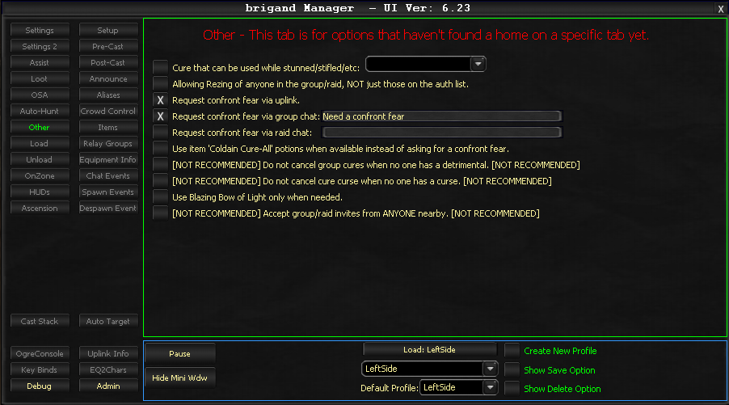

# Other

The Other tab contains miscellaneous settings that do not fit into other categories.

## Cure While Stunned/Stifled

Activates an ability when control effects prevent casting.

!!! note
    This only checks your own status, not the status of others. It may trigger false activations on uncurable debuffs.

## Resurrect Non-Authorized Group/Raid Members

When enabled, allows casting resurrection on any group or raid member, regardless of their authorization list status.

## Confront Fear Requests

Configure how Confront Fear requests are communicated:

- **Request via Uplink** - Sends the request through the Uplink system
- **Request via group chat** - Sends the request through group chat
- **Request via raid chat** - Sends the request through raid chat

## Group Cure Management

!!! warning "Not Recommended"
    **Do not cancel group cures when no one has a detrimental** - Prevents cancellation of group cures even when no detrimentals are detected.

## Curse Cure Management

!!! warning "Not Recommended"
    **Do not cancel cure curse when no one has a curse** - Prevents cancellation of curse cures even when no curses are detected.

## Blazing Bow of Light

- **Use only when needed** - Only uses Blazing Bow of Light when the situation requires it

## Group/Raid Invitations

!!! warning "Not Recommended"
    **Accept Group/Raid Invites from ANYONE nearby** - Accepts invites from any nearby player regardless of who they are.

<!-- Source: wiki.ogregaming.com - This page may need updating -->
