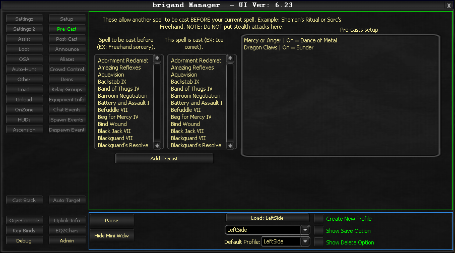

# Pre-Cast

The Pre-Cast tab allows you to configure spells that should cast before other specific spells. This is useful for abilities like Shaman's "Ritual" buff or Sorcerer's "Freehand Sorcery" that need to be active before casting a main spell.

The system checks these conditions whenever the bot attempts to cast a spell.

!!! note
    The spell no longer requires to be maintained. It will be slightly faster (approximately half a second) if it does appear in maintained.

## Configuration

### Spell to be cast before

Designates the spell that executes prior to your main spell (the prerequisite ability).

### This spell is cast

Specifies the actual spell being cast (the primary action).

## Usage

- **Double-click** an entry to toggle it on or off

## Example Workflow

You can chain multiple pre-cast spells before a main ability. For instance:

1. Freehand Sorcery -> Ice Comet
2. Catalyst -> Ice Comet

If both prerequisites are available, the system executes them sequentially before casting the primary spell (Ice Comet).

<!-- Source: wiki.ogregaming.com - This page may need updating -->
