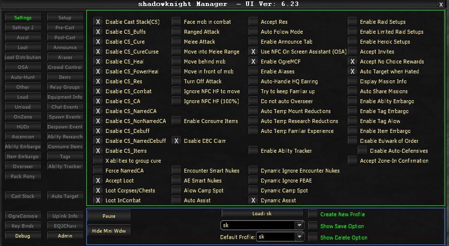

# Settings

The Settings tab controls high-level on/off functions for the bot. The checkboxes here enable or disable entire categories of behavior. For example, the buff checkbox turns all buffing on or off, while the Buffs tab controls which specific buffs you want.

## Column 1: Cast Stack Controls

### Cast Stack Management

- **Disable Cast Stack (CS)** - Disables the entire cast stack
- **Disable CS_Buffs** - Disables buff casting from the cast stack
- **Disable CS_Cure** - Disables cure casting
- **Disable CS_CureCurse** - Disables curse curing
- **Disable CS_Heal** - Disables healing
- **Disable CS_PowerHeal** - Disables power healing
- **Disable CS_Res** - Disables resurrection
- **Disable CS_Combat** - Disables combat abilities
- **Disable CS_CA** - Disables combat arts
- **Disable CS_NamedCA** - Disables named-only combat arts
- **Disable CS_NonNamedCA** - Disables non-named combat arts
- **Disable CS_Debuff** - Disables debuffs
- **Disable CS_NamedDebuff** - Disables named-only debuffs
- **Disable CS_Items** - Disables item usage

### Other Functions

- **X abilities to group cure** - Priests only; cancels current spell to cast group cure
- **Force Named CA** - Treats all NPCs as Named
- **Accept Loot** - Enables loot acceptance
- **Loot Corpses/Chests** - Loots corpses and chests (does not move character)
- **Loot InCombat** - Allows looting during combat

## Column 2 Top: Combat Positioning

- **Face mob in combat** - Automatically faces the target mob during combat
- **Ranged Attack** - Enables ranged auto-attack
- **Melee Attack** - Enables melee auto-attack
- **Move into Melee Range** - Moves the character into melee range of the target
- **Move Behind Mob** - Moves behind the mob (uses collision checks)
- **Move In Front of Mob** - Moves in front of the mob (uses collision checks)
- **Turn Off Attack** - Disengages auto-attack when target becomes invalid
- **Ignore NPC HP to move** - Moves regardless of NPC health percentage
- **Ignore NPC HP (100%)** - Ignores NPC HP threshold when at 100%

## Column 2 Bottom: Items & Nuking

- **Enable Consume Items** - Enables automatic consumption of items
- **Disable DBC Claim** - Disables Daybreak Cash claim functionality
- **Encounter Smart Nukes** - Enables smart encounter (green AE) nuke logic
- **AE Smart Nukes** - Enables smart AE (blue AE) nuke logic
- **Move to Area/Allow Camp Spot** - Enables camp spot movement behavior
- **Auto Assist** - Enables automatic assist on the designated target

## Column 3 Top: Automation Features

- **Accept Res** - Automatically accepts resurrection
- **Auto Follow Mode** - Enables automatic follow behavior
- **Enable Announce Tab** - Activates the Announce tab functionality
- **Use NPC On Screen Assistant (OSA)** - Enables the On Screen Assistant for NPC tracking
- **Enable OgreMCP** - Enables the OgreMCP control panel
- **Enable Aliases** - Enables command aliases
- **Auto-Handle HQ Earring** - Automatically handles Heritage Quest earring updates
- **Try to keep Familiar up** - Automatically resummons familiar if dismissed
- **Do not auto Overseer** - Prevents automatic Overseer mission handling
- **Auto Temp Mount Reductions** - Automatically applies temporary mount training reductions
- **Auto Temp Research Reductions** - Automatically applies temporary research reductions
- **Auto Temp Familiar Experience** - Automatically applies temporary familiar experience boosts

## Column 3 Bottom: Dynamic Settings

- **Enable Ability Tracker** - Enables ability tracking
- **Dynamic Ignore Encounter Nukes** - Dynamically ignores encounter nukes based on conditions
- **Dynamic Ignore PBAE** - Dynamically ignores point-blank AE abilities based on conditions
- **Dynamic Camp spot** - Dynamically adjusts camp spot behavior
- **Dynamic Assist** - Dynamically adjusts assist behavior

## Column 4: Raid & Group Options

### Raid/Heroic

- **Enable Raid Options** - Enables raid-specific options
- **Enable Limited Raid Options** - Enables a subset of raid options
- **Enable Heroic Setups** - Enables heroic dungeon setups
- **Accept Invites** - Automatically accepts group/raid invites
- **Accept No Choice Rewards** - Automatically accepts rewards with no alternative choices
- **Auto Target when Hated** - Automatically targets an NPC when on its hate list
- **Display Mission Info** - Displays mission/quest information
- **Auto Share Missions** - Automatically shares missions with the group

### Embargo/Tag Systems

- **Enable Ability Embargo** - Enables the ability embargo system
- **Enable Tag Embargo** - Enables the tag embargo system
- **Enable Tag Allow** - Enables the tag allow system
- **Enable Item Embargo** - Enables the item embargo system
- **Disable Bulwark of Order** - Disables Bulwark of Order usage
- **Disable Auto-Defensives** - Disables automatic defensive ability usage
- **Accept Zone-In Confirmation** - Automatically accepts zone-in confirmation dialogs

<!-- Source: wiki.ogregaming.com - This page may need updating -->
