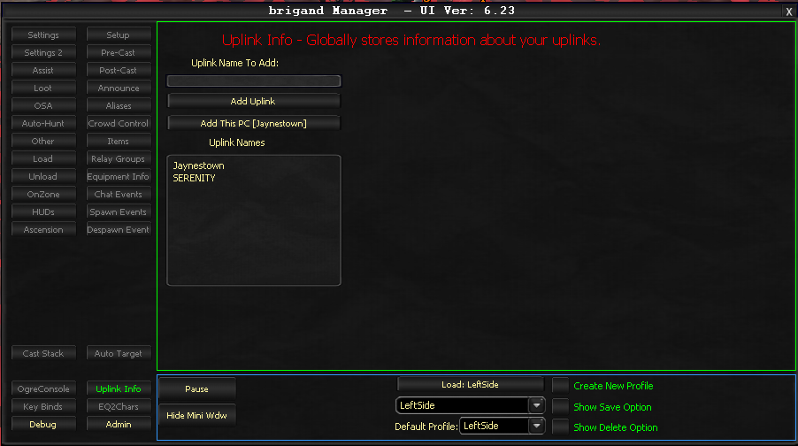

# Uplink Info

The Uplink Info tab shows the computers you have connected to the Uplink system.

This tab provides a visual overview of all currently connected machines, allowing you to verify that your multi-computer setup is communicating properly.

<!-- Source: wiki.ogregaming.com - This page may need updating -->
