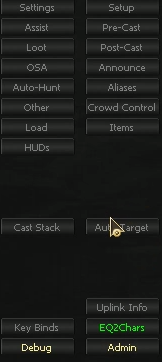
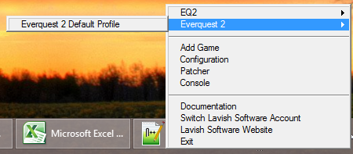
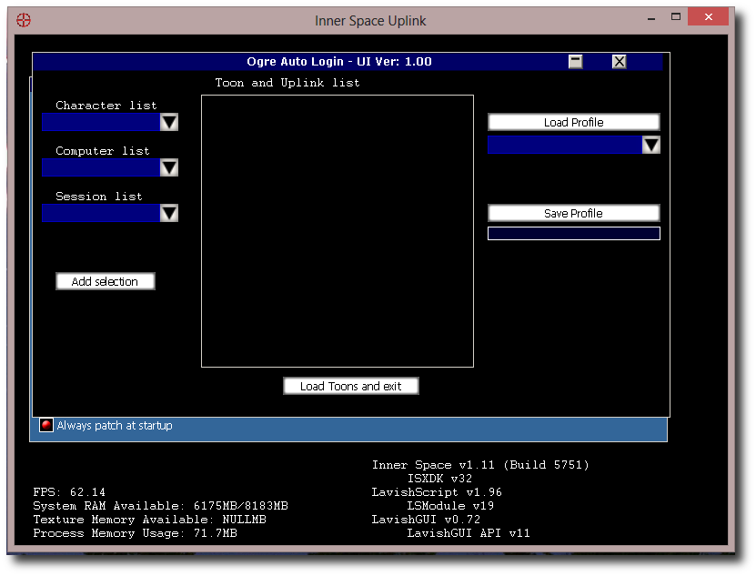

# Auto Login

OgreAutoLogin enables opening sessions and logging characters into specific InnerSpace sessions automatically. This is an advanced feature requiring specific setup including Windows shortcuts.

!!! tip "Quick Start"
    To auto-login a single character, complete the **Before You Begin** section below, launch EQ2, open the InnerSpace console (`~` key), and type `ogre login toonname`.

---

## Before You Begin

Complete **all** of the following prerequisites before attempting to use Auto Login:

- A blank loginscene (see the [First Run](../getting-started/first-run.md) guide)
- Character login information filled in on the [EQ2 Chars](../ogrebot/tabs/eq2-chars.md) tab



- Computer name(s) configured in the [Uplink Info](../ogrebot/tabs/uplink-info.md) tab
- ISXOgre set to autoload
- PC powered on and plugged in
- InnerSpace running in 64-bit mode (verify via right-click Configuration, confirming **Use 64-bit Inner Space Uplink** is checked)

---

## Step-by-Step Setup

### Step 1: Prerequisites

Complete all items in the **Before You Begin** section. Do not skip any steps.

### Step 2: Edit AutoLoginSettings.xml

Open the file at:

```
InnerSpace/Scripts/EQ2OgreCommon/OgreAutoLogin/AutoLoginSettings.xml
```

Modify these values (case-sensitive):

| Setting | Value |
|---------|-------|
| `GameName` | `Everquest 2` |
| `ProfileName` | `everquest 2 default profile` |
| `TimeToWaitAfterLoadingASession` | `150` |
| `TimeToWaitBetweenLoadingSessions` | `50` |

To find the correct values, right-click the InnerSpace taskbar notification, view the GameName list, and hover over Everquest 2 to see the ProfileName.



### Step 3: Create a Desktop Shortcut

1. Right-click your desktop and select **New > Shortcut**
2. Click **Browse** and locate `InnerSpace.exe`
3. Append `runscript eq2ogrecommon/OgreAutoLogin/AutoLogin` to the path

**Examples:**

```
D:\Games\InnerSpace\InnerSpace.exe runscript eq2ogrecommon/OgreAutoLogin/AutoLogin
```

```
"C:\Program Files\Innerspace\InnerSpace.exe" runscript eq2ogrecommon/OgreAutoLogin/AutoLogin
```

!!! note
    If your path contains spaces, wrap it in quotes.

### Step 4: Launch the Auto Login UI

Double-click the desktop shortcut. The UI loads inside the Uplink console and may appear in the background or as a taskbar window.



If the window is missing, right-click the InnerSpace icon and select **Console**.

### Step 5: Configure Character Login Profiles

**Setting up the character list:**

1. Select the first character from the Character List
2. Select the PC for this character
3. Select the InnerSpace Session name (e.g., IS1)
4. Click **Add Selection**
5. Repeat for each character

**Session behavior:**

| Session | Behavior |
|---------|----------|
| **Any** | Character stays on its current session |
| **Specific** (IS1, IS2, etc.) | If the character is online, it verifies the correct session. If offline, it logs off that session if in use |

!!! warning
    Alt characters currently logged on will be disconnected to allow the selected characters to log in.

**Saving profiles:**

1. Type a profile name on the right side
2. Click **Save Profile**
3. Saved profiles appear under **Load Profile** next time
4. Click **Load Toons and exit**
5. Wait for all characters to log in (this can take several minutes)
6. Close the InnerSpace Console

### Step 6: Repeat

Launch the shortcut any time you need to log your characters in.

---

## Loading a Specific Profile Automatically

Once you have saved a profile through the UI, you can create a shortcut that bypasses the UI entirely:

1. Create a new Desktop Shortcut (same method as above)
2. Append the profile name to the path:

```
D:\Games\InnerSpace\InnerSpace.exe runscript eq2ogrecommon/OgreAutoLogin/AutoLogin MainGroup
```

Replace `MainGroup` with your saved profile name. This shortcut will automatically log your characters without showing the UI.

---

## Using Multiple Computers

All computers must be connected before running AutoLogin shortcuts.

### Create a Connection Shortcut

1. Create a shortcut to `InnerSpace.exe`
2. Append: `runscript eq2ogrecommon/ogreconnect`

```
D:\Games\InnerSpace\InnerSpace.exe runscript eq2ogrecommon/ogreconnect
```

Name it **Ogre Connect**. Nothing visible happens when you run it -- it simply connects the computers. All computers must use identical naming in InnerSpace game profile configuration.

### Multi-Computer Startup Sequence

1. Launch InnerSpace on all computers
2. Double-click the **Ogre Connect** shortcut
3. Double-click the **Auto Login** shortcut (UI or specific profile)

---

## Quirks and Known Issues

- Start InnerSpace **before** double-clicking shortcuts. Launching InnerSpace from shortcuts may skip parameters if patching is needed.
- There is limited user error checking -- use common sense with character/session assignments.
- Occasional session crashes when rearranging characters (rare, not reproducible). If a crash occurs, check the Uplink console for the line `Command given: ogre -<stuff>-` and report the `<stuff>` portion.
- Loading Ogre AutoLogin loads ISXOgre into Uplink. If you need to patch ISXOgre while in-game, unload it via console: `ext -unload isxogre`

<!-- Source: wiki.ogregaming.com/eq2/index.php/OgreOther:AutoLogin - This page may need updating -->
