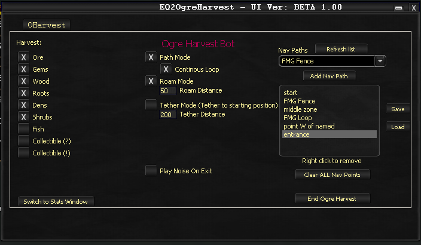
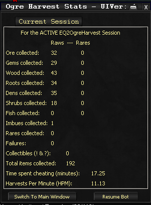

# Harvesting

Ogre Harvest automates resource gathering in EverQuest 2. It uses [OgreMapper](ogre-mapper.md) waypoints to navigate a zone and harvest nodes along the way.

!!! note "Requirements"
    OgreBot must be running before you start Ogre Harvest. You must also have a mapped path for the zone you want to harvest in (see [OgreMapper](ogre-mapper.md)).

---

## Setup

### Step 1: Map Your Zone

Use [OgreMapper](ogre-mapper.md) to create waypoints in the zone you want to harvest. When mapping for harvesting:

- Name custom points roughly every 40 meters or at logical locations
- Navigate around obstacles extensively to create navigational points
- For loop paths, position the final point near the starting point

### Step 2: Launch

Open the tool using the console command:

```
Ogre Harvest
```



### Step 3: Configure Your Path

1. Click **Refresh** to load your Nav Paths list
2. Add each waypoint sequentially to the path list
3. For non-loop paths, add the points in reverse order at the end to create a return route
4. **Save** the path for future reuse

### Step 4: Select Harvest Types

Choose which types of harvest nodes you want to collect (ore, wood, roots, etc.).

### Step 5: Configure Path Mode

Set whether the path runs continuously in a loop or executes once.

### Step 6: Configure Roam Mode

Determine whether movement away from the established path is permitted and set the maximum roaming distance.

### Step 7: Tether Mode

Tether mode is an advanced option. Consult the developer if you need to use it.

### Step 8: Start Harvesting

Click **Start** to begin the harvest run.

---

## Statistics

Monitor the statistics window during operation to track harvest counts and progress.



<!-- Source: wiki.ogregaming.com/eq2/index.php/Ogre_Harvest - This page may need updating -->
