# Inventory Manager

The Ogre Inventory Manager provides comprehensive inventory automation for selling, trading, brokering, destroying, transmuting, depot management, restocking, quiver refilling, and crafting material management.

To open the Inventory Manager, type in the console:

```
ogre im
```

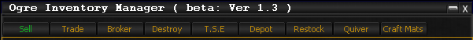

!!! warning "Use At Your Own Risk"
    The Inventory Manager is powerful and can sell, destroy, or trade items automatically. The developer is not responsible for any lost, sold, or destroyed items.

---

## Tabs

The Inventory Manager contains nine functional tabs:

| Tab | Purpose |
|-----|---------|
| [Sell](#sell) | Sell items to merchants |
| [Trade](#trade) | Trade items between characters |
| [Broker](#broker) | List items on the broker |
| [Destroy](#destroy) | Destroy items from inventory |
| [T.S.E](#tse-transmute-salvage-extract) | Transmute, Salvage, or Extract items |
| [Depot](#depot) | Deposit items into depots |
| [Restock](#restock) | Pull items from containers |
| [Quiver](#quiver) | Refill ammunition |
| [Crafting Mats](#crafting-mats) | Pull crafting materials from depots |

---

## Sell

Sells all items from a list you create to a merchant.

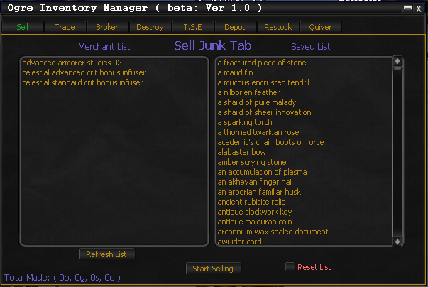

### How to Use

1. Open a merchant window in-game
2. The **Merchant List** shows available items. Items already in your saved list appear in green.
3. **Double-click** an item to add it to the Saved List (auto-saves to XML)
4. **Right-click** an item in the Saved List to remove it
5. Click **Start Selling** to begin

### CLI Commands

```
ogre im -sell -end
```

| Flag | Description |
|------|-------------|
| `-sell` | Start the sell process |
| `-end` / `-endwhenfinished` | End the script after processing completes |

### API Methods

| Method | Description |
|--------|-------------|
| `OgreIMAPI.Sell:Start` | Start selling |
| `OgreIMAPI.Sell:Add_To_List["Item Name","-save"]` | Add item to list |
| `OgreIMAPI.Sell:Remove_From_List["Item Name","-save"]` | Remove item from list |
| `OgreIMAPI.Sell:Clear_List["-save"]` | Clear entire saved list |

---

## Trade

Trades items from character to character. Can trade to multiple people in one use.

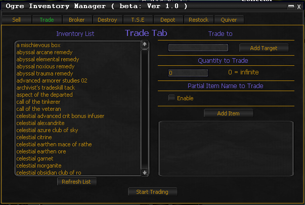

### How to Use

1. Select items from the **Inventory List**
2. Enter the target character name in **Trade To** (or use the auto-target button)
3. Set the **Quantity to Trade** (use `0` for all of that item)
4. Optionally enable **Partial Item Name** matching
5. Click **Add Item** to build the final list
6. **Right-click** items in the Final List to remove them
7. Click **Start Trading** to begin

!!! note
    The inventory list does not filter untradeable items to avoid 3-5 minute server delays.

---

## Broker

Lists items on the broker automatically.

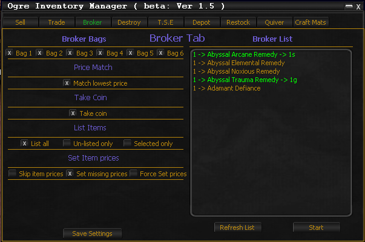

### How to Use

1. Select which **Broker Bags** to scan using the checkboxes
2. Optionally enable **Price Match** to match the lowest broker price
3. Choose a listing mode:
    - **List all items** from selected bags
    - **Un-Listed only** -- only items not currently listed
    - **Selected only** -- only highlighted items (use ++ctrl+left-button++ for multiple selections)
4. Choose a pricing mode:
    - **Skip item prices** -- bypass price configuration
    - **Set missing prices** -- configure prices for items without one
    - **Force set prices** -- configure prices for all items

### Set Prices Window

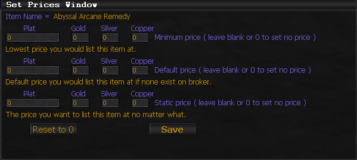

| Field | Description |
|-------|-------------|
| **Minimum Price** | Lowest acceptable listing price. Items below this will not list. |
| **Default Price** | Used when no broker listings exist for the item |
| **Static Price** | Overrides all other pricing, forcing a fixed price |

### Broker Listing Colors

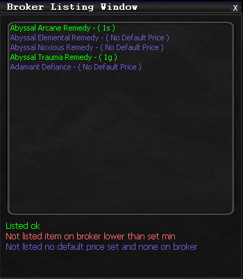

| Color | Meaning |
|-------|---------|
| **Green** | Listed successfully |
| **Red** | Existing listings undercut your minimum price |
| **Purple** | Item not on broker and no default price set |

---

## Destroy

Destroys items from your inventory based on a saved list. It destroys **all** of an item if it exists in your inventory.

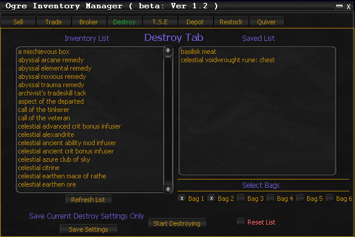

### How to Use

1. The **Inventory List** shows all items. Items already in your saved list appear in green.
2. **Double-click** an item to add it to the destruction list (auto-saves)
3. **Right-click** an item in the Saved List to remove it
4. Select which **bags** to process using the checkboxes
5. Click **Start Destroying** to begin

### CLI Commands

```
ogre im -destroy -end
```

### API Methods

| Method | Description |
|--------|-------------|
| `OgreIMAPI.Destroy:Start` | Start destroying |
| `OgreIMAPI.Destroy:Add_To_List["Item Name","-save"]` | Add item |
| `OgreIMAPI.Destroy:Remove_From_List["Item Name","-save"]` | Remove item |
| `OgreIMAPI.Destroy:Set_Settings["-bag",2,TRUE]` | Configure bag settings |
| `OgreIMAPI.Destroy:Clear_List["-save"]` | Clear entire list |

---

## T.S.E (Transmute, Salvage, Extract)

Processes items using Transmute, Salvage, or Extract based on your selections.

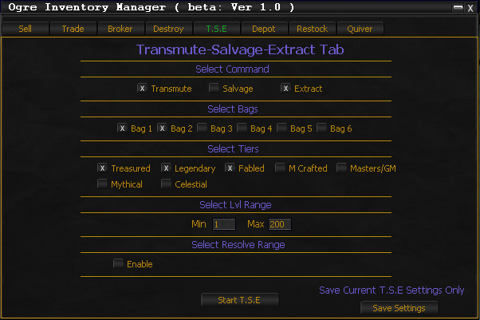

### How to Use

1. Select the desired **commands** (Salvage and Transmute cannot run simultaneously)
2. Select which **bags** to process
3. Select **item tiers** to include
4. Set **level range** (minimum and maximum)
5. Optionally set a **Resolve Range** -- processes items with resolve at or under the entered amount
6. Click **Start TSE**

### CLI Commands

```
ogre im -tse -end
```

Alternate flag: `-t.s.e`

### API Methods

| Method | Description |
|--------|-------------|
| `OgreIMAPI.TSE:Start` | Start TSE |
| `OgreIMAPI.TSE:Set_Settings["-transmute",TRUE]` | Enable transmute |
| `OgreIMAPI.TSE:Set_Settings["-salvage",TRUE]` | Enable salvage |
| `OgreIMAPI.TSE:Set_Settings["-extract",TRUE]` | Enable extract |

Additional `Set_Settings` parameters: `-treasured`, `-legendary`, `-mastercrafted`, `-fabled`, `-masters`, `-mythical`, `-celestial`, `-enableresolve`, `-bag <num> <TRUE/FALSE>`, `-min <level>`, `-max <level>`, `-resolve <level>`

---

## Depot

Deposits items from your inventory into depots based on your selections.

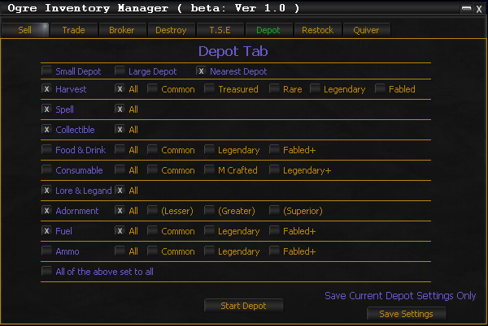

### How to Use

1. Select **Depot Size**: Small, Large, or Nearest
2. Check the **Depots** you want to use (shown in purple)
3. Check **Depot Options** for each depot (shown in orange). Selecting "All" disables other options.
4. Or check **All of the Above** to select everything
5. Click **Start Depot**

### CLI Commands

```
ogre im -depot -end
```

### API Methods

| Method | Description |
|--------|-------------|
| `OgreIMAPI.Depot:Start` | Start depot process |
| `OgreIMAPI.Depot:Set_Settings["-harvestdepot",TRUE]` | Enable harvest depot |

Available depot parameters: `-nearestdepot`, `-smalldepot`, `-largedepot`, `-harvestdepot`, `-spelldepot`, `-collectibledepot`, `-faddepot`, `-consumabledepot`, `-laldepot`, `-adorndepot`, `-fueldepot`, `-ammodepot`, `-alldepot`

Each depot has sub-options (e.g., `-harvestall`, `-harvestcommon`, `-harvesttreasured`, `-harvestlegendary`, `-harvestfabled`, `-harvestrare`).

---

## Restock

Pulls items from containers (consumable, adornment, food & drink depots) based on a saved list.

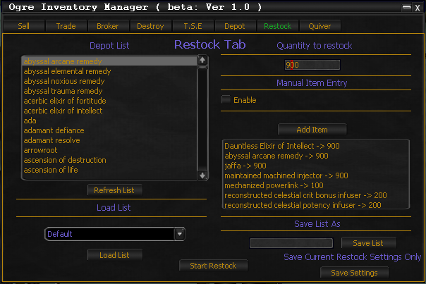

### How to Use

1. Click **Refresh List** to scan available depots
2. Highlight items from the Depot List, set the **Quantity to Restock**, and click **Add Item**
3. Or use **Manual Item Entry** to type item names (use the Examine button to pull names from examine windows)
4. Build your list, then **Save List As** with a name (minimum 4 characters)
5. Use **Load List** to reload saved lists
6. Click **Start Restock** to begin

### CLI Commands

```
ogre im -restock -end
```

### API Methods

| Method | Description |
|--------|-------------|
| `OgreIMAPI.Restock:Start` | Start restocking |
| `OgreIMAPI.Restock:Load_List["List Name"]` | Load a saved list |
| `OgreIMAPI.Restock:Add_Item["Item Name",Qty]` | Add item with quantity |

---

## Quiver

Automatically refills ammunition. Prioritizes ammo already in your ammo bag, then draws from a default or custom list if the bag is empty.

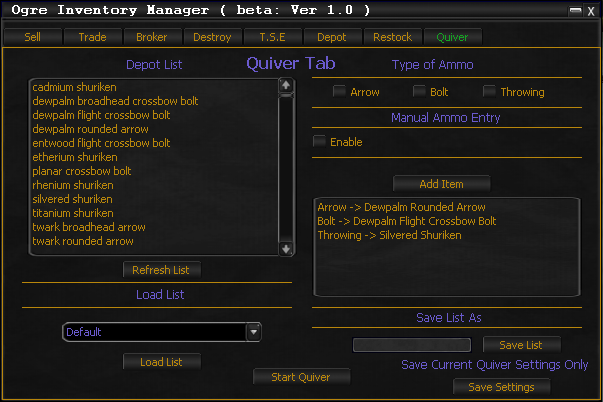

### How to Use

1. Click **Refresh List** to scan ammo depots
2. Select items and check the **Type of Ammo** (arrow, bolt, or throwing)
3. Click **Add Item** (at least one ammo type must be checked, no duplicate types allowed)
4. Save your list and click **Start Quiver**

### CLI Commands

```
ogre im -quiver -end
```

### API Methods

| Method | Description |
|--------|-------------|
| `OgreIMAPI.Quiver:Start` | Start quiver process |
| `OgreIMAPI.Quiver:Load_List["List Name"]` | Load a saved list |

---

## Crafting Mats

Pulls crafting materials from Harvest depots, Fuel depots, and Fuel Merchants based on a saved list.

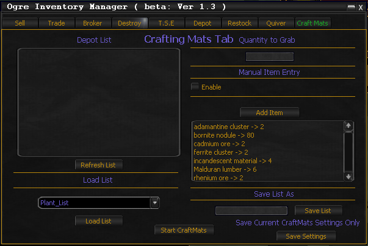

### How to Use

1. Click **Refresh List** to scan harvest/fuel depots and fuel merchants
2. Highlight items, set the **Quantity**, and click **Add Item**
3. Or use **Manual Item Entry** with the Examine button
4. Save your list and click **Start Craft Mats**

### CLI Commands

```
ogre im -craftmats -end
```

### API Methods

| Method | Description |
|--------|-------------|
| `OgreIMAPI.CraftMats:Start` | Start craft mats process |
| `OgreIMAPI.CraftMats:Load_List["List Name"]` | Load a saved list |
| `OgreIMAPI.CraftMats:Add_Item["Item Name",Qty]` | Add item with quantity |

---

## General CLI Notes

All tab commands can be chained together:

```
ogre im -sell -depot -tse -end
```

The `-end` or `-endwhenfinished` flag should always be passed **last**. It terminates the Inventory Manager script after all processing completes.

<!-- Source: wiki.ogregaming.com/eq2/index.php/Ogre_Inventory_Manager - This page may need updating -->
