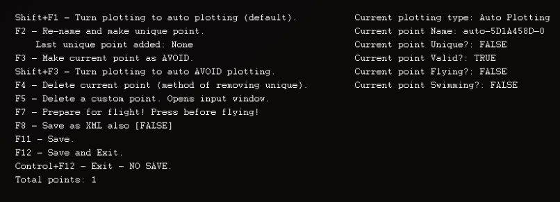

# OgreMapper

OgreMapper is a zone mapping and waypoint marking tool. It records navigation points that other Ogre tools (such as [Harvesting](harvesting.md)) use to move through zones.

---

## How It Works

OgreMapper uses a **points, not paths** system. Rather than plotting specific routes, it records individual waypoints and dynamically determines optimal navigation between them.

> **:warning: Limitations**
>
> OgreMapper does not support flying or swimming navigation.

---

## Getting Started

Activate OgreMapper by typing in the console:

```
Ogre map
```

---

## Critical Mapping Rules

> **:no_entry: Never Name a Point with Only a Number**
>
> Naming a point with a number only (e.g., `1`, `42`) will break the entire map. Always use descriptive names.

- All connections are **bidirectional** -- move carefully during mapping
- **Never jump**, cliff run, or descend hills you cannot climb back up
- Walk the path naturally so the mapper records a traversable route

---

## Map Creation Example

A practical example using Antonica:

1. Activate the mapper (`Ogre map`)
2. Walk from the NQ zone entrance toward the Mage Tower
3. Name waypoints with prefixes (e.g., `ZoneNQ`, `MageTower`)
4. Walk carefully to each destination
5. Save the completed map

---

## Keyboard Controls



| Key | Action |
|-----|--------|
| ++shift+f1++ | Enable auto-plotting |
| ++f2++ | Name or rename a waypoint |
| ++f3++ | Mark current point as avoidance area |
| ++shift+f3++ | Enable auto-avoid plotting |
| ++f4++ | Delete current point |
| ++f5++ | Delete custom point |
| ++f7++ | Prepare for flight (centers camera) |
| ++f8++ | Save as XML option |
| ++f11++ | Save map |
| ++f12++ | Save and exit |
| ++ctrl+f12++ | Exit without saving |

---

## Tips

- Name waypoints descriptively with zone-area prefixes (e.g., `ZoneNQ`, `Bridge01`)
- Place points roughly every 40 meters for good harvesting coverage
- For loop paths, place the final point near the starting point
- Always test your map by running it before relying on it

<!-- Source: wiki.ogregaming.com/eq2/index.php/OgreMapper - This page may need updating -->
