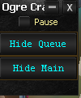
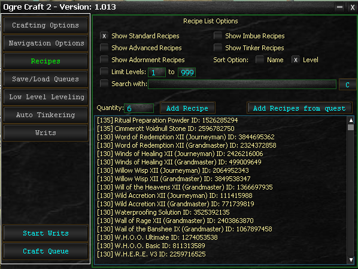
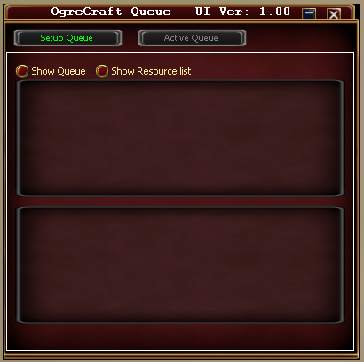

# OgreCraft

OgreCraft is a crafting bot included with your ISXOgre subscription. It was completely rewritten from scratch in 2026 (internally known as "Craft 2") to provide a fully-featured crafting automation experience for EverQuest 2.

> **:memo: Craft 2 Rewrite**
>
> OgreCraft was rebuilt from the ground up in 2026. If you used the original version, the interface and workflow have changed significantly.

---

## What Is OgreCraft?

OgreCraft automates the crafting process in EQ2. You select what you want to craft, how many, and OgreCraft handles the rest -- including reacting to crafting events and using the correct abilities at the right time.

> **:memo: Included With Your Subscription**
>
> OgreCraft is bundled with OgreBot. No separate purchase is required.

---

## Key Features

### Recipe Queues

Select items from your recipe book, specify quantities, and add them to a crafting queue. OgreCraft works through the queue automatically. You can save and load queues to reuse common crafting lists across sessions and characters.

### Writ Automation

OgreCraft can automatically complete up to 200 crafting writs in sequence. Make sure you have adequate materials and fuel available, with vendors or brokers nearby. The system will automatically continue any existing Rush Order Writs, or get one from a nearby Agent.

> **:bulb: Prepare Your Materials**
>
> Before starting a writ run, ensure you have enough raw materials and fuel. OgreCraft does not automatically purchase missing materials unless configured to do so.

### Experiment Ability

OgreCraft supports the Experiment prestige ability for crafting. Note that there is a small chance of failure when experimenting, which can destroy the item being crafted.

### Craftlite

A lightweight version called **Craftlite** runs in the background for crafting-only tasks. Use this when you want to craft without the full OgreCraft interface.

**To start Craftlite:**

```
ogre craftlite
ogre cl
```

**To stop Craftlite:**

```
ogre end craftlite
ogre end cl
```

---

## The Interface

OgreCraft has three main windows:

| Window | Purpose |
|--------|---------|
| **Mini Window** | Compact controls -- pause, hide/show the main window |
| **Main Window** | All configuration options and crafting controls |
| **Queue Window** | Shows items being prepared, resource quantities, and active queue progress |







---

## Command Line Interface

Advanced users and scripters can interact with OgreCraft through console commands, providing access to extensive crafting methods and data.

For the full scripting API -- including all available methods, members, events, and example workflows -- see the [OgreCraftAPI Reference](../developer/ogrecraft-api.md).

<!-- Source: wiki.ogregaming.com/eq2/index.php/OgreCraft:Overview - This page may need updating -->
