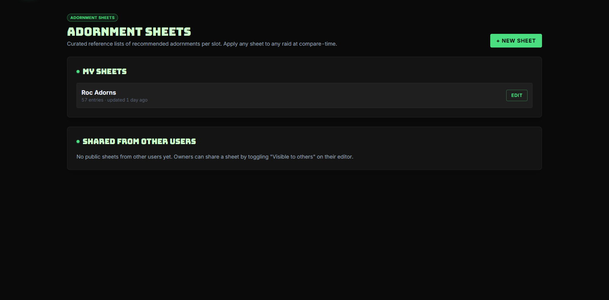
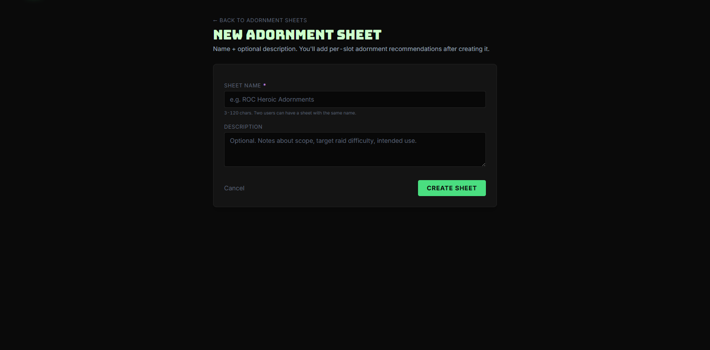
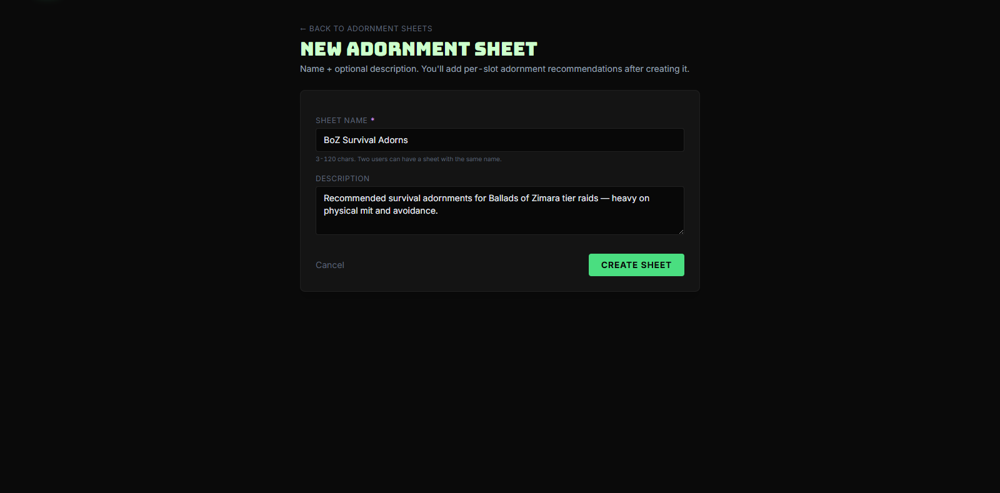
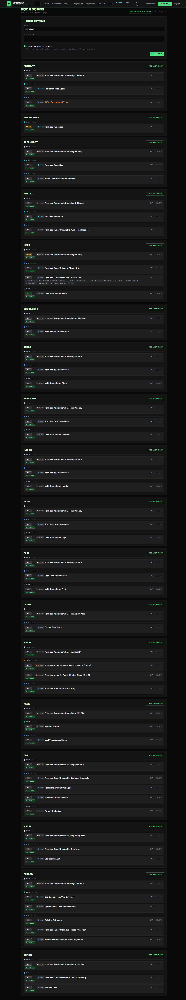
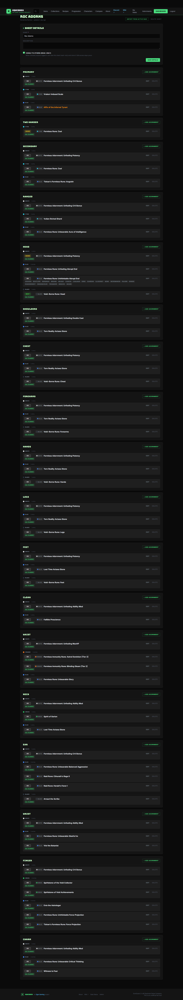
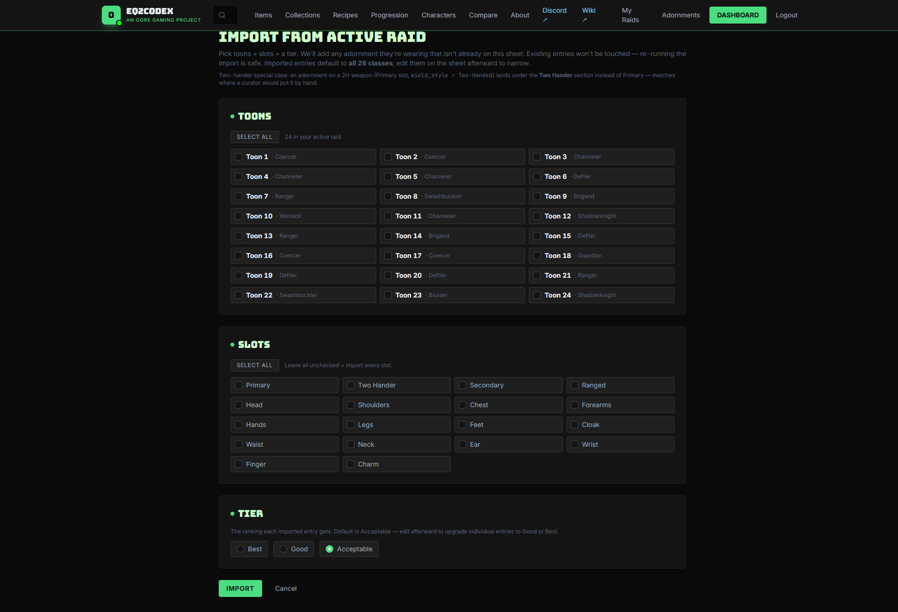

# Adornment Sheets

An **adornment sheet** is a curated reference list of "the right adornments per slot" — what your guild considers the recommended white/blue/black/orange/cyan/green adornments for a given tier or role. Once you've built a sheet, you can apply it to any raid's gear report and instantly see who's compliant and who's not.

It's the cross-tier alternative to keeping a Discord pin titled "current adornment recs" — sheets live in codex, are versioned per author, can be shared with other users, and plug directly into the [My Raids](my-raids.md) gear report.

**Live URL:** [eq2codex.com/adornment-sheets](https://eq2codex.com/adornment-sheets)

---

## 1. Open the index

From the top nav, click **Adornments** to open the sheets index:

Two sections:

- **My sheets** — sheets you own. Each card shows the name, entry count, and "updated X ago" timestamp. Click the title to open the editor; the **Edit** button does the same.
- **Shared from other users** — sheets other users have built and toggled **Visible to others** on. You can apply these to your own raids' gear reports without owning the sheet — useful when one guild member maintains the canonical list and everyone else just consumes it.

To start a fresh sheet, click **+ New sheet**.

---

## 2. Create a sheet

The new-sheet form is intentionally minimal — just the metadata:

Fill in:

- **Name *** — what shows up in the dropdown when applying to a raid. Be specific: "BoZ Survival Adorns", "ROC Tank Recommended", "Healer Crit Bonus Push" — generic names ("My Sheet") get confusing fast once you have more than two.
- **Description** — optional notes. Why this sheet exists, what tier it targets, any class caveats. Shows up under the title in the editor and is searchable.
- **Visible to others** — leave off for personal/draft sheets; flip on once you're ready to share. Visibility-on sheets show up in every other codex user's **Shared from other users** index and the **Compare adornments** dropdown on every raid gear report.

Click **Create sheet** and you land in the editor with all 21 slots laid out, waiting for entries.

---

## 3. Add entries

The editor renders one row per slot, in the same order as the in-game equipment window (Head, Arms, Chest, …, Cloak, Charm1, Charm2, …, Waist). Each row has slots for each adornment **colour** that slot supports:

To add an entry:

1. **Pick a colour** for the slot — white, blue, black, orange, cyan, or green (depending on which colours the slot supports).
2. The autocomplete activates ("Pick a color first…" → real search). Start typing the adornment name, and codex filters live to **only adornments matching that colour and slot**. No need to scroll past 800 wrong-slot/wrong-colour adornments.
3. Pick the right one and the entry locks in.

A few details worth knowing:

- **Notes per entry** — each entry has an optional note field. Use it for "alternative: X if you can't get Y" or "Channeler only" — anything that needs to ride along with the recommendation.
- **Multiple entries per slot/colour** — you can list more than one "acceptable" white adornment for a slot. The compare view treats them as an OR (any of them counts as compliant).
- **Save is autosaved** — there's no "Save changes" button. Edits commit per-row as you go.

The full editor scrolled top-to-bottom:

> **:bulb: Don't fill every slot at once**
> A 57-entry sheet didn't get built in one sitting. Start with the slots that matter most for the role you're optimising — usually the four armor pieces, then weapon/cloak/charm — and grow it tier by tier as new adornments come out.

---

## 4. Import from your Active Raid

If your guild already has toons wearing the exact adornments you want to canonise into a sheet, you can skip the manual entry. Click **Import** from the editor's header to open the **Import from Active Raid** view:

The view has three pickers stacked vertically:

- **Toons** — every member of your current [active raid](https://eq2codex.com/active-raid), with a per-toon checkbox plus a **Select all** at the top. Pick one toon (to canonise their personal kit), pick several (to take the intersection of what your tanks are wearing, say), or pick all 24.
- **Slots** — restrict the import to specific slots, or leave everything unchecked to import every slot.
- **Tier** — the ranking each imported entry gets. Defaults to **Acceptable** — bump it to **Good** or **Best** during the import, or leave it at Acceptable and upgrade individual entries afterward on the editor.

Hit **Import** and codex walks every selected toon's gear, picks up each adornment they're wearing, and stages it as an entry under the chosen tier.

Import is **additive by default** — "existing entries won't be touched, re-running the import is safe." You can run it once with your tank, again with your healer, again later when someone upgrades, and codex just keeps merging in what's new.

> **:bulb: Two-hander special case**
> An adornment on a 2H weapon (Primary slot, `wield_style = Two-Handed`) lands under the **Two Hander** section instead of Primary — matching where a curator would place it by hand.

> **:bulb: This is the fastest way to seed a tier-launch sheet**
> Right after a new expansion drops, find the first toons in your guild who fully kit out, import from all of them at once, then trim. Beats typing 50+ adornment names from the wiki.

---

## 5. Clone an existing sheet

From the editor (or the index card's menu), **Clone** creates a copy of the sheet under your ownership. The clone is independent of the original — your edits don't affect the source, and vice versa.

The two most common reasons to clone:

- **Branching from someone else's shared sheet** — you like 90% of their recommendations but want to swap out a couple. Clone, edit, done. The original author's sheet stays untouched.
- **Spinning a role variant off your own master sheet** — clone your tank sheet, rename to "Tank — survival heavy", swap a few stats-adornments for survival-adornments. Now you have two sheets you can apply situationally.

---

## 6. Share a sheet

Toggle **Visible to others** in the sheet's settings to publish it. Every codex user immediately sees the sheet in:

- The **Shared from other users** section of their `/adornment-sheets` index.
- The **Compare adornments** dropdown on every raid's gear report.

There's no fine-grained ACL — visibility is binary, on or off, all-users or no one. If you need an actual private-with-guild model, the workaround is to keep the sheet off and share its content out-of-band (Discord, etc.); we can iterate on richer sharing if there's demand.

---

## 7. Apply a sheet to a raid

Once the sheet exists (or you're consuming someone else's shared sheet), open any raid's gear report at `/raid/{slug}` and pick the sheet from the **COMPARE ADORNMENTS** dropdown at the top-right.

The gear table re-renders with green/yellow/red compliance highlights per adornment slot — see the [My Raids walkthrough](my-raids.md#compare-against-an-adornment-sheet) for what that looks like in practice.

---

## FAQ

> **:memo: Can I delete a sheet that other people are using?**
> Yes — deletion is owner-controlled and immediate. Anyone who had it pinned in a raid's compare dropdown will see that dropdown option vanish on next page load. If a sheet is genuinely shared infrastructure, prefer leaving it up and updating it in place; if it's truly retired, deleting it is fine.

> **:memo: A shared sheet's owner updated it — do my raids pick that up?**
> Yes, instantly. There's no snapshotting — when you apply a sheet to a raid, the gear report reads the *current* state of that sheet's entries every render. If you want a frozen version, clone the sheet to your own ownership.

> **:bulb: How granular should sheets be?**
> One per role per tier is the sweet spot most users land on — e.g., "ROC — Tank", "ROC — Healer (Templar/Inq)", "ROC — DPS Caster". Going finer (one per class) bloats the dropdown; going coarser (one mega-sheet for "everything ROC") loses the compliance signal because half the entries don't apply to whoever you're comparing.
