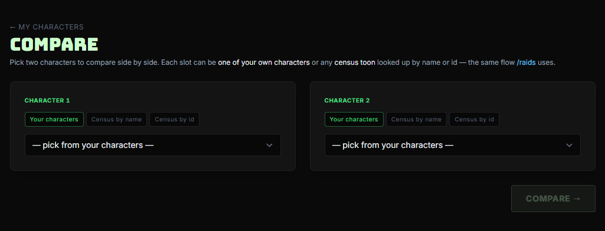
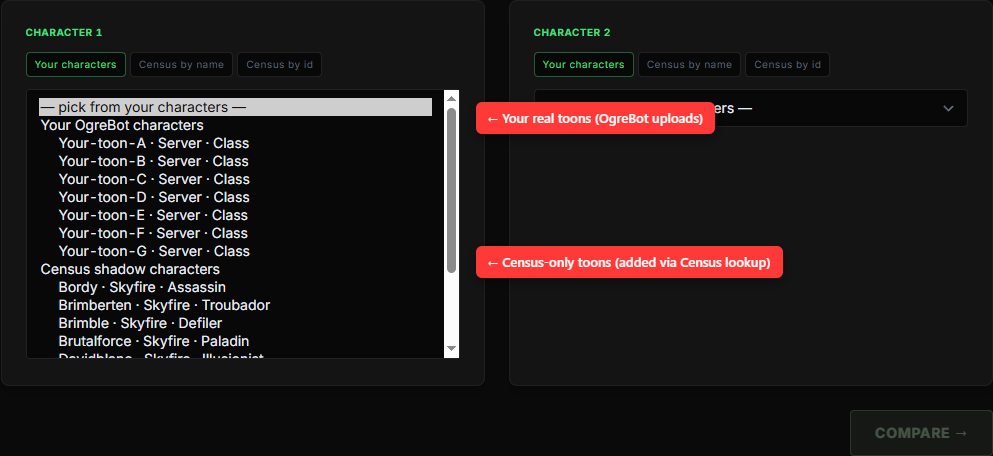
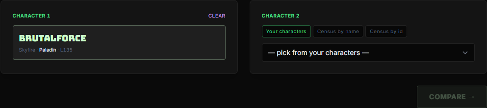
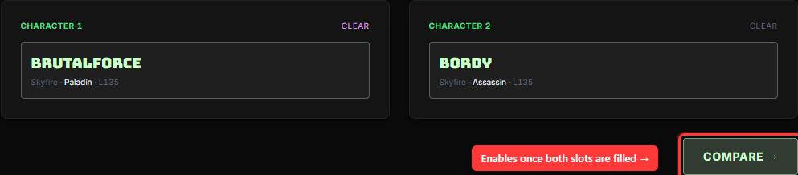
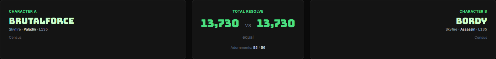
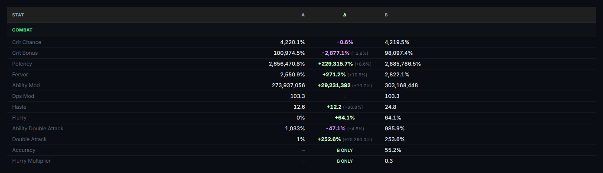
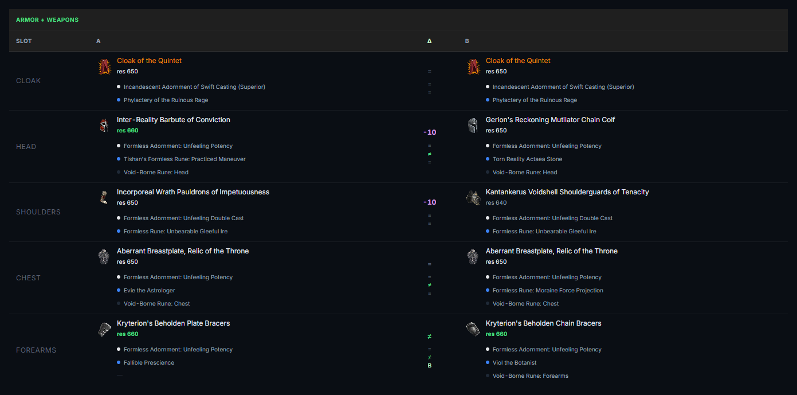

# Comparing Characters

The **Compare** page puts two toons side by side and shows you exactly where they differ — stats, gear, adornments, and Total Resolve — at a glance.

It's the same view raid leaders use to spot which alt is behind on a particular adornment slot, or which class swap would gain the most Potency. You can compare any two characters visible to you, including **census-only "shadow" toons** that someone added by name from the [raid management screen](https://eq2codex.com/raids) (no upload needed).

**Live URL:** [eq2codex.com/compare](https://eq2codex.com/compare)

---

## 1. Open the picker

From the top nav, click **Compare**. With no characters selected yet, you'll see the empty picker:

Two slots, two ways to fill each one:

- **Your characters** — pick from the dropdown of toons you own or have been granted visibility to.
- **Census by name** — look up any live EQ2 character by name + server (creates a census shadow row if the toon isn't already in codex).
- **Census by id** — same lookup but by Daybreak Character ID.

> **:bulb: No upload required for the other side**
> You can compare one of your own toons against any census toon that's been pulled into codex. If the toon isn't there yet, the **Census by name** lookup will pull it for you the first time.

---

## 2. Pick the first character

Open the **Your characters** dropdown. The list is split into two groups:

- **Your OgreBot characters** — toons whose stats and gear you've uploaded via OgreBot. These rows always have the freshest data.
- **Census shadow characters** — census-only toons added by you (or anyone in your raid). Stats/gear come from the Daybreak census API.

> **:bulb: How to get your toons into the "OgreBot characters" group**
> In OgreBot, open the **Codex Toons** tab and upload from there. Once uploaded, the toon shows up in this dropdown automatically.

Pick one. The slot collapses to a card showing the toon's name, server, class, and level:

---

## 3. Pick the second character and Compare

Repeat for slot 2. Once both slots are filled, the **Compare** button lights up:

Click it. You land on the 1v1 results view.

> **:memo: Permalink-friendly**
> The results URL contains the two character IDs (`/compare?ids=12,9`). Bookmark it, drop it in Discord — anyone who can view both characters will see the same comparison.
>
> Character IDs are **global** — `12` is the same toon for everyone in codex (one row per server + name, shared across the whole database). The URL is universal; access is gated purely by visibility. If your raid mate can't see one of the IDs, that side falls back to "not visible" instead of the permalink 404'ing.

---

## 4. Read the results

The page opens with a three-panel header showing who's being compared and the headline number:

- **Character A** (left), **Character B** (right) — each card shows server, class, level, and whether the data came from an OgreBot upload or census.
- **Total Resolve** (centre) — sum across all 21 gear slots, side by side, plus the **Adornments** ratio (how many of the 56 possible adornment slots are filled on each toon).

The "Δ" column you'll see further down always reads as **B − A**:

- **Mint-green** = B is higher
- **Red** = A is higher
- **`=`** = exactly equal
- **`A only` / `B only`** = stat exists on one side, missing on the other

### Stats

Below the header, stats are broken into the same sections the in-game persona window uses — General, Attributes, Defense, Combat, Casting / Reuse — plus a catch-all **Other** for stats that don't fit a panel.

A few details worth knowing:

- Big percent values keep their thousand separators (`2,656,470.8%`), so you can actually read Potency without squinting.
- Equal stats are still shown (with a quiet `=`) so you can scan for "actually different" rows by colour alone.

### Gear

Two tables follow: **Armor + Weapons** (11 slots) and **Accessories** (10 slots). Each row puts the item side by side with its adornments listed underneath:

The "Δ" column packs **one symbol per row** — first the item itself, then one per adornment slot (white / blue / black / orange where applicable):

- **`=`** — both sides identical
- **`≠`** — both sides have something, but it's different
- **`+N` / `-N`** — same item, different resolve level (B has +N resolve, A has -N resolve)
- **`A` / `B`** — only one side has an item / adornment in that slot

In the screenshot above, **Cloak** is identical (the Δ column reads `= = =` — same item, same two adornments). **Forearms** differs (`≠ = ≠ B` — different items, same white adornment, different blue, B has a black adornment A is missing).

> **:bulb: Read the gear column top-to-bottom**
> The first Δ symbol is always the item. The rest are adornments in the order they appear on the item — white, blue, black, then orange/cyan/green where the slot supports them. If a row has fewer adornment symbols than you expected, that slot doesn't use the extra colours.

---

## Comparing more than two toons

Compare is strictly 1v1 — it's optimised for "did this one slot regress" answers, not roster sweeps. For multi-toon side-by-side, use **[My Raids](https://eq2codex.com/raids)** instead: the raid management page shows every member's stats and gear in one table, with filtering, sorting, and column selection.

---

## FAQ

> **:memo: My toon doesn't show up in the dropdown**
> The dropdown lists toons you own plus toons that have been shared with you (e.g. raid members where the owner set visibility to "raid"). If you expected a toon to appear and it doesn't, check your character's visibility setting on its [character detail page](https://eq2codex.com/characters).

> **:memo: Stats look stale**
> OgreBot characters are only as fresh as the last upload. Census shadow characters can be refreshed from the [character detail page](https://eq2codex.com/characters) (**Refresh from Census** button). Raid-wide bulk refresh runs from the [raid management screen](https://eq2codex.com/raids).

> **:warning: Census-only toons can't show everything**
> The Daybreak census API doesn't expose all the stats OgreBot does (it's missing some of the newer SOD/ROC stats). If a row reads `A only` or `B only` for a stat you know both toons have, the missing side is usually a census shadow toon where the API doesn't return that field.
