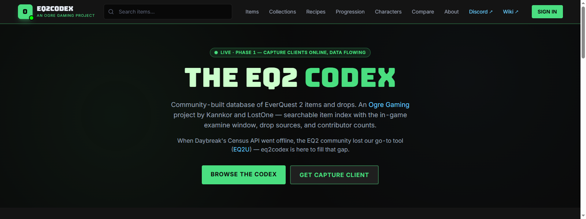
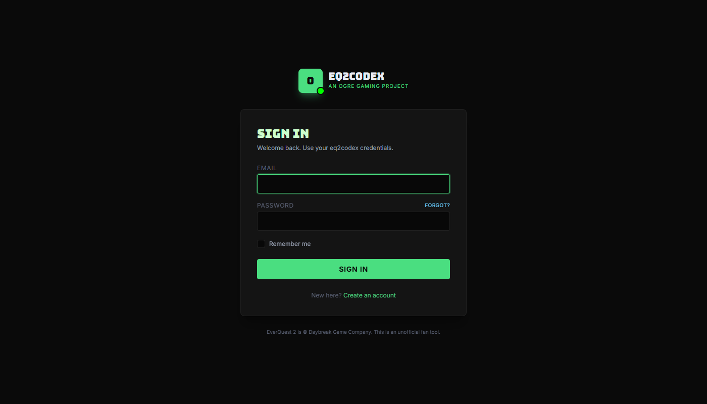
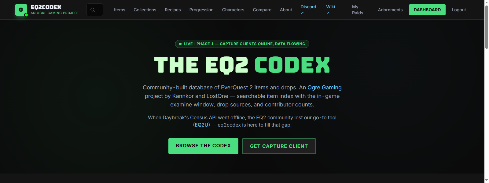
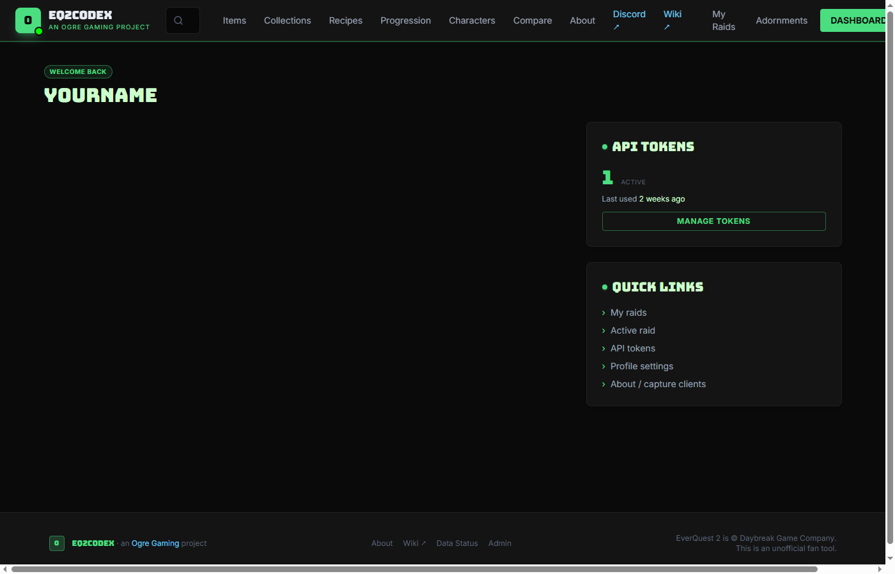
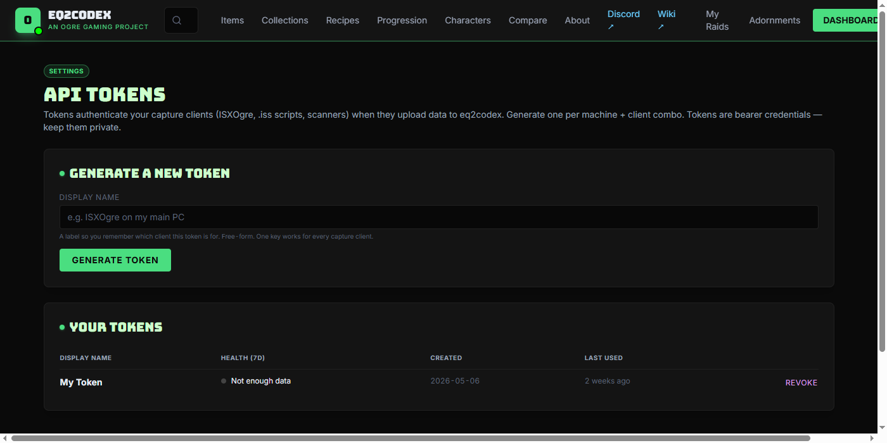
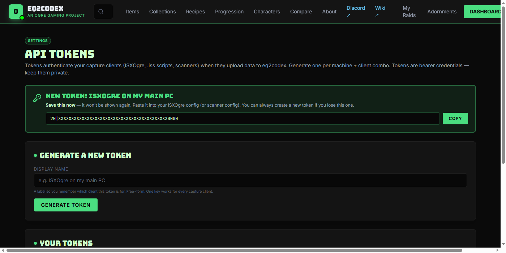

# Getting an API Token

To upload data with the ACT plugin, OgreBot's **Codex Inspect** / **Codex Toons** tabs, or the standalone log scanner, you need an **eq2codex API token**. Tokens are created from your account settings and act as bearer credentials — one token works for every capture client tied to that account.

This walkthrough is **five clicks end-to-end**.

---

## 1. Create an account (or sign in)

Go to [eq2codex.com](https://eq2codex.com/). In the top-right corner of the nav bar, click **SIGN IN** if you already have an account, or pick **Create an account** from the sign-in page if you don't.

The sign-in form is the standard email + password pair, with a **Create an account** link below for first-time users:

---

## 2. Open your dashboard

Once you're signed in, the **SIGN IN** button is replaced by a **DASHBOARD** button. Click it.

---

## 3. Open the token manager

Your dashboard has an **API tokens** card on the right side, showing the count of active tokens and when one was last used. Click **MANAGE TOKENS** on that card.

---

## 4. Generate a token

The token manager has one input field — **Display name** — and a **Generate token** button. The display name is free-form; it's only there so *you* remember which capture client this token is for. "ISXOgre on my main PC", "Laptop ACT", "scanner-vm-1" — anything that helps you tell tokens apart.

Type a label and click **Generate token**:

> **:bulb: One token works for every capture client**
> You don't need a separate token per capture client (ACT plugin / Codex Inspect / Codex Toons / scanner). One token per machine is the usual setup — name it after the machine, not after the client.

---

## 5. Copy the token immediately

This step is **very important**: the freshly-generated token is shown **once**, in a green banner at the top of the page, and is never displayed again. Click **COPY** (or select-all + copy by hand) and paste it somewhere safe.

If you lose the token before pasting it into your capture client, no big deal — scroll down to **Your tokens**, hit **REVOKE** next to the one you lost, and run through step 4 again to generate a fresh one.

---

## What to do with the token

You're done on the codex side. Take the copied token and paste it into whichever capture client you're configuring:

- **ACT plugin** — see the **About** page on [eq2codex.com/about](https://eq2codex.com/about) for installation steps.
- **OgreBot Codex Inspect / Codex Toons tabs** — open OgreBot, click the **Codex Inspect** tab, hit **Setup API Token**, paste, save.
- **Standalone log scanner** — see [eq2codex.com/install/standalone](https://eq2codex.com/install/standalone) for the download + setup walkthrough.

---

## FAQ

> **:memo: How many tokens should I have?**
> One per machine that uploads is the normal setup. The token field is per-account, so all your tokens show up in the same list — and the same token works for every capture client on that machine.

> **:memo: What if I think a token leaked?**
> Revoke it immediately from **Your tokens** on the [API tokens page](https://eq2codex.com/settings/api-tokens), then generate a new one and re-paste it into your capture client. Revocation takes effect on the next upload attempt.

> **:bulb: Why does the page say "Save this now — it won't be shown again"?**
> Tokens are stored hashed in the database — codex itself doesn't keep the plaintext after generation. The reveal is your only chance to copy it. If you lose it, revoke + regenerate is the only path forward.
