# My Raids

The **My Raids** page is where you build a persistent raid roster, hand-pick who sits in which group, and then read everyone's gear and adornments side by side in one table.

It's the same surface raid leaders use for "did Bob's offhand regress this week?" or "who in the raid is missing a black adornment on cloak?" — without juggling 24 browser tabs. You can populate a raid from your own [OgreBot-uploaded toons](getting-a-token.md), from any **census-only "shadow" toon** (just by name + server), or both — they live side by side in the same roster.

**Live URL:** [eq2codex.com/raids](https://eq2codex.com/raids)

---

## 1. Create a raid

From the top nav, click **My Raids**. If you've never made one, the index is empty:

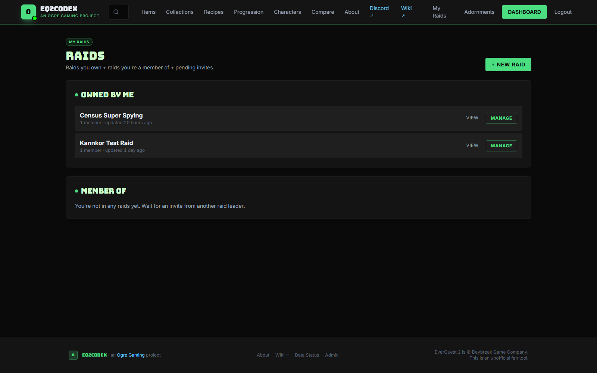

Click **+ New raid** to open the create form:

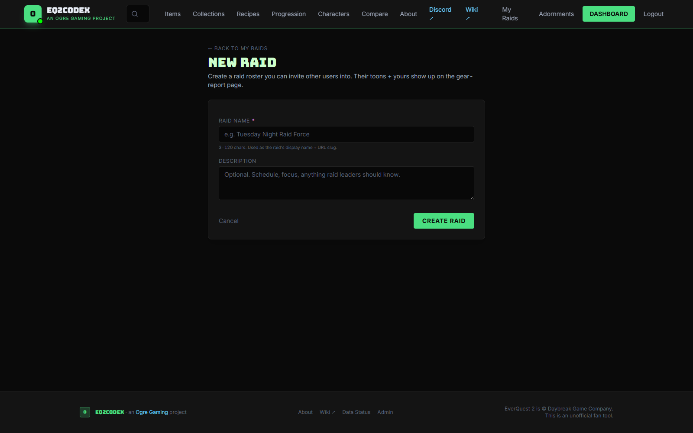

Fill in:

- **Name** — what you'll see in the raid list. "Tuesday Night Raid Force", "Census Super Spying", whatever you want.
- **Visibility** — who can see this raid and its roster:
    - **Private** — only you.
    - **Raid members** — only toons listed in the lineup (the standard pick for guild raids — your raiders see themselves and each other, no one else does).
    - **Public** — anyone with the URL can view (handy for sharing a recruitment screenshot).

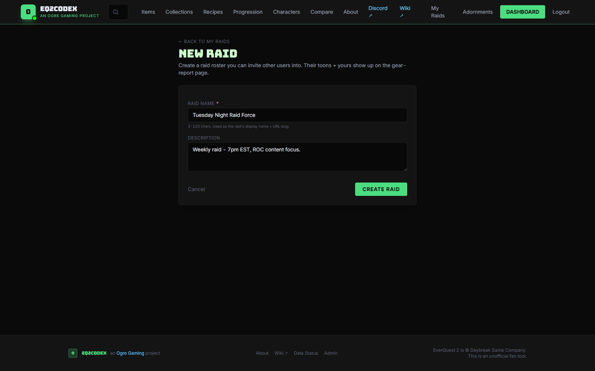

Click **Create raid**. You land on the **Manage** page for the new raid — empty roster, ready to populate:

> **:bulb: Visibility is a per-raid switch, not a per-toon one**
> A toon's own [character visibility](https://eq2codex.com/characters) controls who can see that toon's detail page directly. The raid's visibility controls who can see the *roster*. Adding someone to a "Raid members" raid is what grants the rest of the raid permission to see their gear in this view.

---

## 2. Populate the roster

You have two ways to add toons. They're not exclusive — most raids end up with a mix.

### Option A — From OgreBot uploads

If a toon has been uploaded via OgreBot's **Codex Toons** tab, it shows up in your **My characters** dropdown on the manage page. Pick them and click **Add to raid**. Stats and gear come straight from the freshest upload — exactly what's currently equipped in-game.

> **:bulb: How to get your toons into the "OgreBot characters" group**
> In OgreBot, open the **Codex Toons** tab and upload from there. Once uploaded, the toon shows up across codex — picker dropdowns, your dashboard, and this raid's manage page.

### Option B — Census lookup (works for anyone)

For toons that haven't been uploaded — guild mates, recruits, the parse-loathing tank — use the **Add via census** widget. Type the character name, pick a server, and codex pulls them from Daybreak's census API:

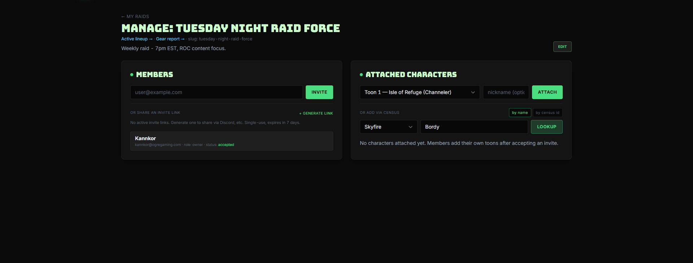

The first time you look up a name, codex creates a **census shadow row** for that toon — a read-only record built from whatever the census API exposes. Subsequent raids can add the same shadow toon without re-fetching.

> **:warning: Census-only toons can't show everything**
> The Daybreak census API doesn't expose every stat OgreBot does (it's missing several of the newer SOD/ROC additions). Shadow toons show *most* of what you need for raid-leader decisions, but the gear panel can have a few "—" cells. For full coverage on a toon, ask the player to upload via OgreBot.

> **:bulb: Census might be unavailable**
> If the lookup returns "Census is temporarily unavailable", that's Daybreak's API being down, not codex. Retry in a few minutes — codex will pick the call right back up.

Mix and match until the roster has everyone you care about:

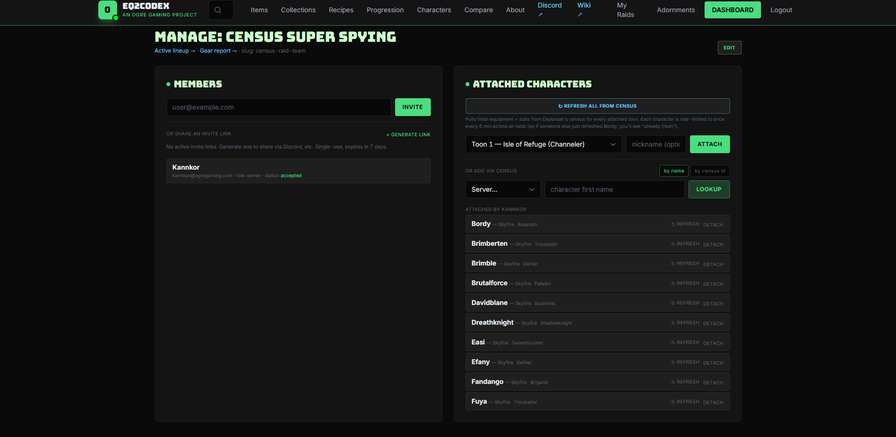

Each row in the roster shows the toon's name, server, class, level, where the data came from (OgreBot upload vs census shadow), and a per-row **Refresh from census** button so you can re-pull a shadow toon's gear without touching anyone else. The **Refresh all from census** button at the top batch-refreshes every shadow row at once (OgreBot rows are skipped — they're always fresher than census).

---

## 3. Set the lineup

The roster is just the *pool* of toons attached to the raid. The **Lineup** is where you put them into actual raid slots — Main Tank group, Off Tank group, Group 3, Group 4 — so you can read the table the way you'd read the in-game raid window.

Click **Lineup** from the manage page (or the raid card on /raids). You'll see four 6-slot groups. Drop toons in by clicking the slot and picking from the roster:

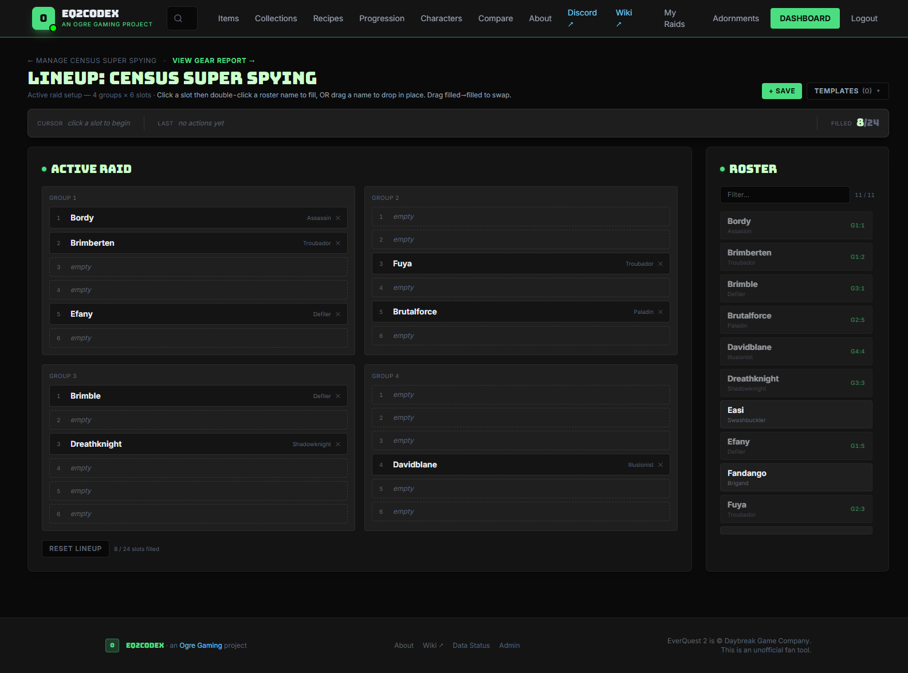

A few touches worth knowing:

- **Drag-and-drop** between slots within or across groups. The page autosaves — no "Save layout" button to remember.
- **Clear slot** empties one position; **Reset lineup** wipes all four groups (handy when shuffling for a new tier).
- **Templates** save a lineup so you can flip the raid between, say, "Wednesday tank-and-spank" and "Friday adds-heavy" without re-dragging every week.

You don't *have* to fill the lineup — the gear report works fine on just the roster — but lineup order is what the report uses to sort rows (MT group first, then OT, then 3, then 4), so a well-arranged lineup gives you a much more readable gear table.

---

## 4. Read the gear report

Back on the raid's main page (`/raid/{slug}`), the **Gear report** is the big payoff: every toon in the roster, every gear slot, side by side, with resolve totals and adornment colour cues:

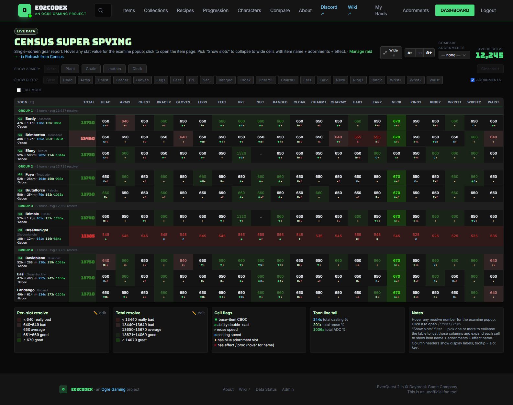

The header strip shows **Avg Resolve** for the raid and the **Total Resolve** per toon. Each cell is one slot for one toon; hover an item name to see the full examine window.

### Filter to one slot

Click any slot pill in the **SHOW SLOTS** strip (Head, Cloak, Ring1, etc.) to filter the table to *just that slot*, blown up wide enough to read full item names plus adornments. Click it again to clear, or hit **Clear** at the start of the row.

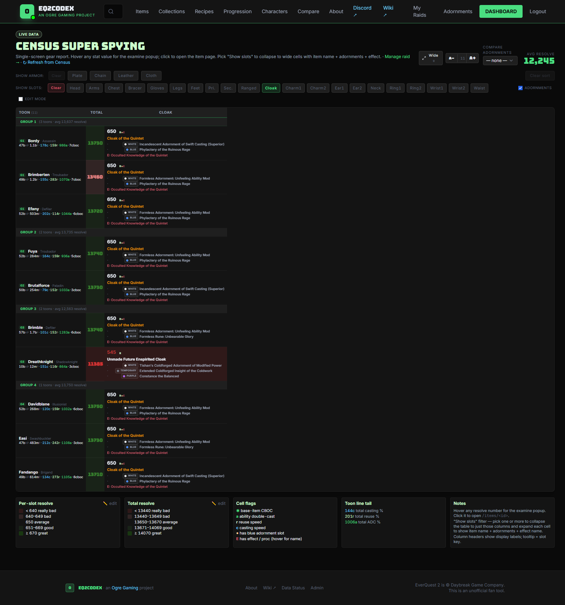

This is the view you use when someone says "did everyone replace their Vorshrev cloak?" — one column, one glance.

### Toggle adornments on/off

The **`☑` Adornments** checkbox controls whether each cell shows the item *plus* its adornments, or just the item name. With adornments off:

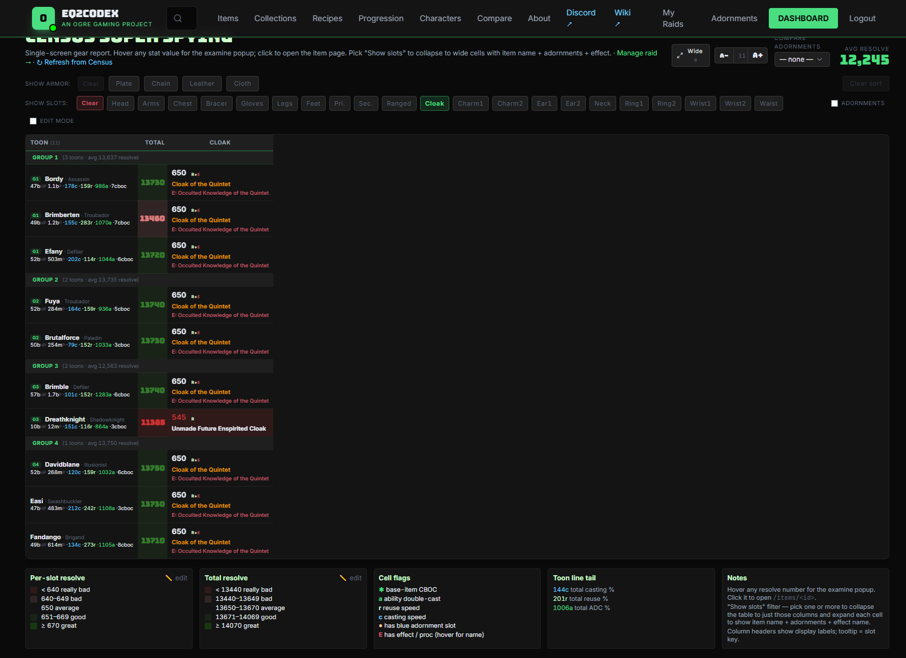

Adornments off is cleaner when you only care about "is everyone wearing the right item." Adornments on is what you want when chasing "who's missing the black."

### Filter by armor class

The **SHOW ARMOR** pills (Plate / Chain / Leather / Cloth) cut the roster to just one armor tier — useful for "show me only my plate wearers" when assigning tank-class gear:

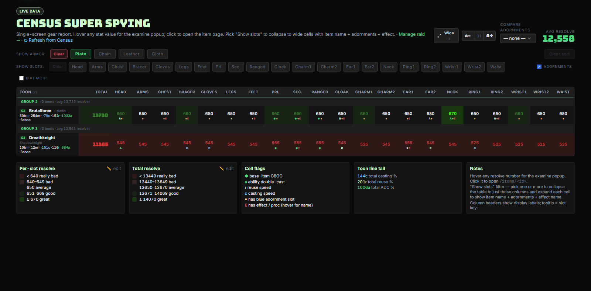

Slot and armor filters stack — pick **Cloak** + **Plate** to see only your plate wearers' cloaks. Layouts persist per browser, so the filters you left on are still on when you come back tomorrow.

### Compare against an adornment sheet

The **COMPARE ADORNMENTS** dropdown at the top-right of the toolbar is where the raid view stops being a passive readout and starts answering "who's missing what."

Pick a saved adornment sheet from the dropdown and the table re-renders with **green / yellow / red highlights** per cell: green = the toon has the recommended adornment, yellow = they have *an* adornment but not the recommended one, red = empty slot. A summary row at the top tells you "this raid is 87% compliant against `Roc Adorns`":

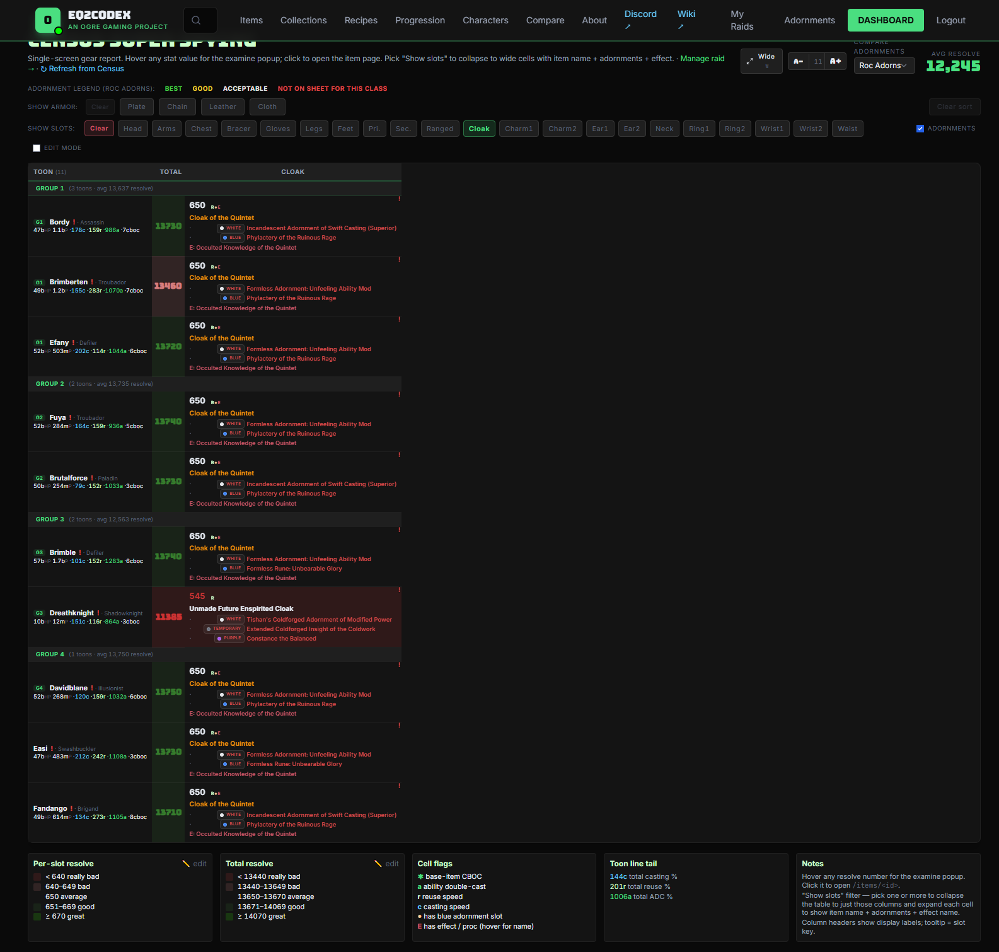

The dropdown lists **your own** sheets plus any sheets other users have marked visible to others — so once your guild has a tier-specific sheet built, every raid leader can pull it without re-typing.

Don't have a sheet yet? See **[Building an adornment sheet](adornment-sheets.md)** for the walkthrough.

---

## Comparing two specific toons head-to-head

The gear report is great for raid-wide scans, but if you want to put two specific toons fully side by side — every stat, every gear slot, every adornment, with explicit Δ columns — use **[Compare](compare-characters.md)** instead. The raid roster and Compare share the same characters; Compare just zooms in on two of them.

---

## FAQ

> **:memo: Why does my toon show "—" for some stats?**
> Census shadow toons can only show what the Daybreak census API exposes — which doesn't include several of the newer SOD/ROC stats. The fix is to have the player upload via OgreBot, which captures everything the in-game persona window has.

> **:memo: Someone left the guild — how do I remove them from the raid?**
> On the manage page, the row has a **Remove** button. Removing a toon from the raid doesn't delete them from codex (other raids might still reference them) — it just unlinks them from this raid's roster and lineup.

> **:memo: Why is the roster's gear so stale?**
> OgreBot characters are only as fresh as the player's last upload — ask them to re-upload from the Codex Toons tab. Census shadow characters can be refreshed in bulk via **Refresh all from census** on the manage page, or per-row from the **Refresh from census** button.

> **:warning: I made the raid Public — can I make it private again?**
> Yes — visibility is editable. Edit the raid from the manage page, change visibility back to Private or Raid members, save. Anyone with the URL who isn't authorized after the change gets a 404.

> **:bulb: What's the difference between "My Raids" and "Active Raid"?**
> **My Raids** is the persistent, hand-curated roster you're reading about here — it survives between sessions, and you control who's in it. **Active Raid** is a separate ephemeral surface fed live from your capture client during an actual raid night — it shows whoever happens to be in your raid window *right now*. Different jobs; both useful.
>
> Active Raid can **only** be populated from OgreBot's **Codex Inspect** tab (the one with the roster/queue/inspect workflow) — that's the tab that pushes live data to `/active-raid`. The separate **Codex Toons** tab is for uploading individual toons into the persistent My characters pool that My Raids and Compare read from.
